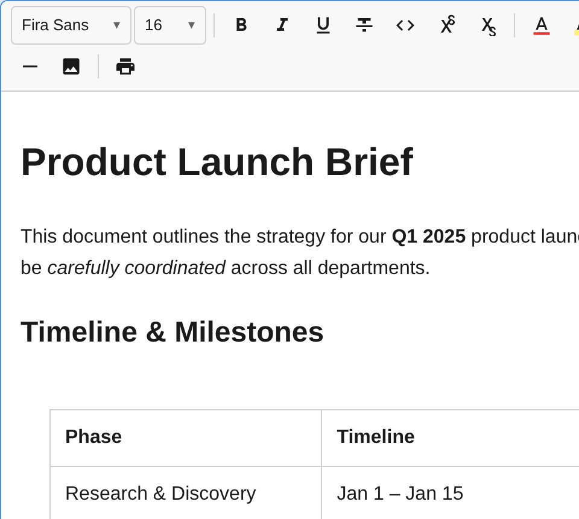
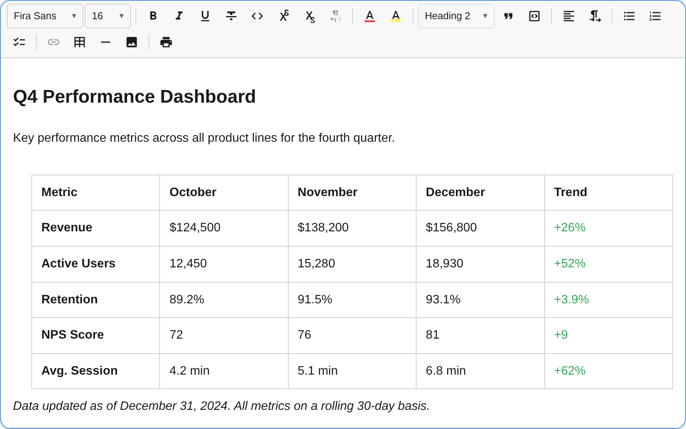

<div align="center">

# notectl

## **A framework-agnostic rich text editor as a Web Component — ship only what you use.**

Built on immutable state, a transaction-based architecture, and a plugin system that powers every feature — from bold text to full table editing.

[](https://www.typescriptlang.org/)
[](https://developer.mozilla.org/en-US/docs/Web/API/Web_components)
[](LICENSE)
[](https://www.npmjs.com/package/@notectl/core)

<br />



</div>

<br />

## Why notectl?

Most editors bolt formatting on top of `contenteditable` and hope for the best. notectl takes a different approach: every keystroke produces an immutable transaction, every feature is a plugin, and the DOM is a projection of state — never the source of truth.

- **Web Component** — drop `<notectl-editor>` into any framework or vanilla HTML
- **Plugin architecture** — every feature (bold, tables, lists, ...) is a plugin; add only what you need
- **Immutable state** — predictable updates, time-travel undo/redo, zero mutation bugs
- **Transaction system** — atomic, invertible steps with middleware support
- **Zero framework lock-in** — works with React, Vue, Svelte, Angular, or plain JS
- **Tiny dependency footprint** — single runtime dependency (DOMPurify)

<br />

## Wanna try? 
Check out the [live playground](https://samyssmile.github.io/notectl/playground/) — no install required.

## Wanna see full working example?
`examples/vanillajs/` is a great place to see everything in action.

## Quick Start


### Install

```bash
npm install @notectl/core
```

### Use

```ts
import {
  createEditor,
  TextFormattingPlugin,
  HeadingPlugin,
  ListPlugin,
  LinkPlugin,
  TablePlugin,
  ToolbarPlugin,
} from '@notectl/core';

const editor = await createEditor({
  toolbar: [
    [new TextFormattingPlugin({ bold: true, italic: true, underline: true })],
    [new HeadingPlugin()],
    [new ListPlugin()],
    [new LinkPlugin(), new TablePlugin()],
  ],
  placeholder: 'Start typing...',
  autofocus: true,
});

document.body.appendChild(editor);
```

That's it. A full-featured editor in 15 lines.

<br />

## Plugins

Every capability is a plugin. Compose exactly the editor you need.

| Plugin | What it does |
|---|---|
| **TextFormattingPlugin** | Bold, italic, underline — individually toggleable |
| **StrikethroughPlugin** | ~~Strikethrough~~ text |
| **HeadingPlugin** | H1 – H6 headings |
| **BlockquotePlugin** | Block quotes |
| **ListPlugin** | Bullet and ordered lists |
| **LinkPlugin** | Hyperlink insertion and editing |
| **TablePlugin** | Full table support with row/column controls |
| **TextColorPlugin** | Text color picker |
| **TextAlignmentPlugin** | Left, center, right, justify |
| **FontPlugin** | Font family selection with custom font support |
| **FontSizePlugin** | Configurable font sizes |
| **HorizontalRulePlugin** | Horizontal dividers |
| **SuperSubPlugin** | Superscript and subscript |
| **HighlightPlugin** | Text highlighting / background color |
| **ToolbarPlugin** | Visual toolbar with grouped items |

### Tables

Full table editing — add/remove rows and columns, navigate with Tab, resize, and select.

<div align="center">

</div>

<br />

## Content API

Read and write content in multiple formats:

```ts
// JSON (immutable Document)
const doc = editor.getJSON();
editor.setJSON(doc);

// HTML (sanitized via DOMPurify)
const html = editor.getHTML();
editor.setHTML('<p>Hello <strong>world</strong></p>');

// Plain text
const text = editor.getText();

// State
editor.isEmpty(); // true | false
```

## Command API

```ts
editor.commands.toggleBold();
editor.commands.toggleItalic();
editor.commands.toggleUnderline();
editor.commands.undo();
editor.commands.redo();
editor.commands.selectAll();
```

## Events

```ts
editor.on('stateChange', ({ oldState, newState, transaction }) => { /* ... */ });
editor.on('selectionChange', ({ selection }) => { /* ... */ });
editor.on('ready', () => { /* ... */ });
editor.on('focus', () => { /* ... */ });
editor.on('blur', () => { /* ... */ });
```

<br />

## Custom Fonts

Bring your own fonts — notectl handles `@font-face` injection automatically.

```ts
import { FontPlugin, STARTER_FONTS } from '@notectl/core';

const Inter = {
  name: 'Inter',
  family: "'Inter', sans-serif",
  category: 'sans-serif',
  fontFaces: [
    {
      src: "url('/fonts/Inter-Variable.ttf') format('truetype')",
      weight: '100 900',
      style: 'normal',
    },
  ],
};

new FontPlugin({ fonts: [...STARTER_FONTS, Inter] });
```

<br />

## Toolbar Configuration

Group plugins into toolbar sections for a clean UI:

```ts
const editor = await createEditor({
  toolbar: [
    [new FontPlugin(), new FontSizePlugin()],
    [new TextFormattingPlugin(), new StrikethroughPlugin(), new TextColorPlugin()],
    [new HeadingPlugin(), new BlockquotePlugin()],
    [new TextAlignmentPlugin()],
    [new ListPlugin()],
    [new LinkPlugin(), new TablePlugin(), new HorizontalRulePlugin()],
  ],
});
```

Each inner array becomes a visually separated group in the toolbar.

<br />

## Examples

Check out the full working example in [`examples/vanillajs`](examples/vanillajs) — it demonstrates every plugin, custom font loading, toolbar grouping, and the complete content API.

```bash
git clone https://github.com/Samyssmile/notectl.git
cd notectl
pnpm install
pnpm dev
```

<br />

## Architecture

```
Input Event → InputHandler / KeyboardHandler
  → Transaction with atomic Steps
  → Middleware chain (priority-ordered)
  → EditorState.apply(tr) → new immutable EditorState
  → Reconciler patches DOM (block-level diffing)
  → Plugins notified via onStateChange()
```

| Layer | Responsibility |
|---|---|
| `model/` | Immutable data — Document, BlockNode, TextNode, Mark, Selection |
| `state/` | EditorState, Transaction, StepApplication, History |
| `view/` | DOM rendering, Reconciler, SelectionSync |
| `input/` | Keyboard/input handling, paste, input rules |
| `commands/` | High-level operations (toggleMark, splitBlock, ...) |
| `plugins/` | All features — every capability is a plugin |
| `editor/` | `<notectl-editor>` Web Component public API |

<br />

## Development

```bash
pnpm install          # install dependencies
pnpm build            # build all packages
pnpm test             # run unit tests (vitest + happy-dom)
pnpm test:e2e         # run e2e tests (playwright)
pnpm lint             # lint (biome)
pnpm typecheck        # type check
```

<br />

## License

[MIT](LICENSE)
