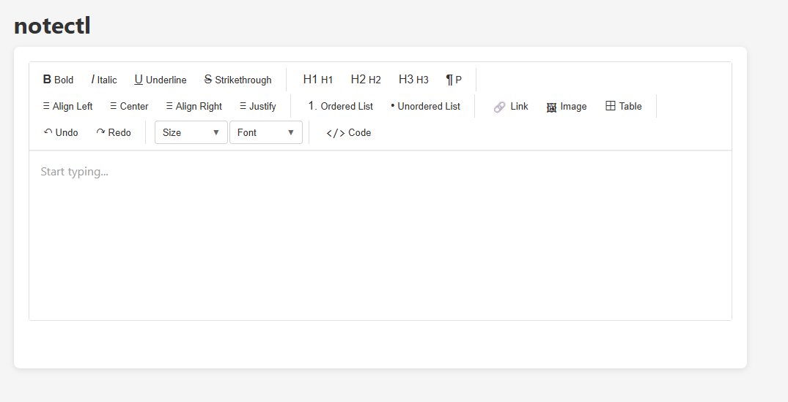

# Notectl - An API Driven Rich Text Editor

> **Status:** Early Development (v0.0.6) - API may change

Notectl is a powerful and flexible rich text editor designed to provide an intuitive user experience while leveraging
the capabilities of modern web technologies. It is built with a focus on extensibility, allowing developers to easily
integrate it into their applications and customize its functionality to meet specific needs.

**Main Goal:** Provide a type-safe, extensible Web Component that delivers a modern rich text editor experience without
depending on framework-specific wrappers.



## 🚀 Quick Start

### Installation

```bash
# Core editor (Web Component)
npm install @notectl/core

# Toolbar plugin (formatting, tables, history, etc.)
npm install @notectl/plugin-toolbar

> Table creation, keyboard navigation, and the contextual menu now live inside the toolbar plugin. Use `createToolbarPlugin({ table: { enabled: boolean, config } })` to turn them on/off or override defaults.
```

## Fonts

Configure project-specific fonts without poking the Shadow DOM:

```typescript
const editor = createEditor(container, {
  appearance: {
    fontFamily: `'Brand Sans', system-ui, sans-serif`,
  },
});

const toolbar = createToolbarPlugin({
  fonts: {
    families: ['Brand Sans'],
  },
});
```

Load the actual `@font-face` declarations via CSS (import, stylesheet, CSS-in-JS, etc.) and Notectl propagates the configured font to the Web Component host as well as the toolbar dropdown.
