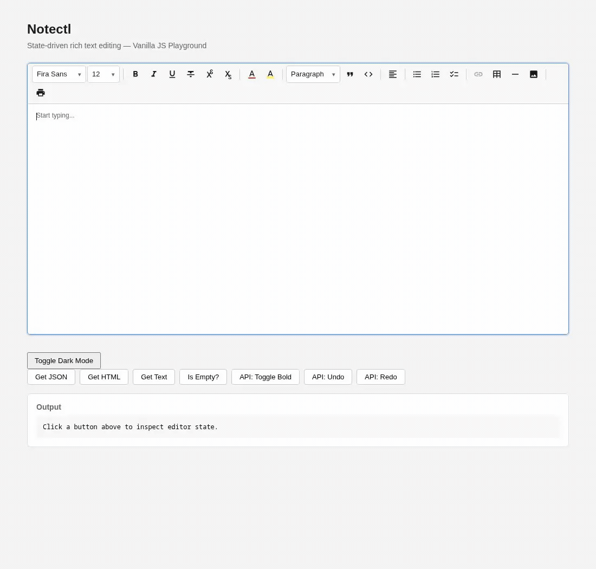

<div align="center">

<br />

# notectl

### Rich text editing as a Web Component

Build a real editor in plain HTML, React, Vue, Svelte, or Angular without locking yourself into a framework-specific editor runtime.

[](https://www.typescriptlang.org/)
[](https://developer.mozilla.org/en-US/docs/Web/API/Web_components)
[](LICENSE)
[](https://www.npmjs.com/package/@notectl/core)
[](https://www.npmjs.com/package/@notectl/core)

<br />



<br />

[Documentation](https://samyssmile.github.io/notectl/) &nbsp;&middot;&nbsp;
[Playground](https://samyssmile.github.io/notectl/playground/) &nbsp;&middot;&nbsp;
[npm: @notectl/core](https://www.npmjs.com/package/@notectl/core) &nbsp;&middot;&nbsp;
[npm: @notectl/angular](https://www.npmjs.com/package/@notectl/angular)

</div>

## What you get

- A framework-agnostic editor shipped as the `notectl-editor` custom element
- Immutable editor state and transaction-based updates
- A plugin system for headings, lists, links, tables, code blocks, images, fonts, and more
- CSP-safe styling with `adoptedStyleSheets`
- A fast path for "just give me a full editor" and a granular path for "I only want these plugins"

## Install

```bash
npm install @notectl/core
```

Requirements:

- Modern browser with Custom Elements support
- Node.js 18+ for build tooling
- Angular 21+ if you use `@notectl/angular`

## Quick start

The normal way to embed notectl is to create the Web Component with `createEditor(...)` and mount it into your app.

### 1. Add a host element

```html
<div id="app"></div>
```

### 2. Create the editor

Start with one of the shipped presets:

Minimal preset:

```ts
import { createEditor } from '@notectl/core';
import { createMinimalPreset } from '@notectl/core/presets/minimal';

const editor = await createEditor({
  ...createMinimalPreset(),
  placeholder: 'Start typing...',
  autofocus: true,
});

document.getElementById('app')!.appendChild(editor);
```

Full preset (toolbar, headings, lists, links, tables, code blocks, images, fonts, and more):

```ts
import { ThemePreset, createEditor } from '@notectl/core';
import { STARTER_FONTS } from '@notectl/core/fonts';
import { ToolbarOverflowBehavior } from '@notectl/core/plugins/toolbar';
import { createFullPreset } from '@notectl/core/presets/full';

const preset = createFullPreset({
  font: { fonts: STARTER_FONTS },
});

const editor = await createEditor({
  ...preset,
  toolbar: {
    groups: preset.toolbar,
    overflow: ToolbarOverflowBehavior.Flow,
  },
  theme: ThemePreset.Light,
  placeholder: 'Start typing...',
  autofocus: true,
});

document.getElementById('app')!.appendChild(editor);
```

Use `createMinimalPreset()` when you want a lean starting point. Use `createFullPreset()` when you want the standard toolbar and plugin set immediately, including responsive toolbar overflow.

## Add notectl to your app

### Plain HTML / Vite / Vanilla JS

```html
<!doctype html>
<html lang="en">
  <head>
    <meta charset="UTF-8" />
    <meta name="viewport" content="width=device-width, initial-scale=1.0" />
    <title>My editor</title>
    <style>
      #app {
        max-width: 800px;
        margin: 2rem auto;
      }

      notectl-editor {
        --notectl-content-min-height: 320px;
      }
    </style>
  </head>
  <body>
    <div id="app"></div>

    <script type="module">
      import { createEditor } from '@notectl/core';
      import { createMinimalPreset } from '@notectl/core/presets/minimal';

      const editor = await createEditor({
        ...createMinimalPreset(),
        placeholder: 'Write something...',
        autofocus: true,
      });

      document.getElementById('app').appendChild(editor);
    </script>
  </body>
</html>
```

### React

```tsx
import { useEffect, useRef } from 'react';
import { createEditor, type NotectlEditor } from '@notectl/core';

export function Editor() {
  const containerRef = useRef<HTMLDivElement>(null);
  const editorRef = useRef<NotectlEditor | null>(null);

  useEffect(() => {
    let mounted = true;

    createEditor({
      placeholder: 'Start typing...',
      autofocus: true,
    }).then((editor) => {
      if (!mounted || !containerRef.current) return;
      containerRef.current.appendChild(editor);
      editorRef.current = editor;
    });

    return () => {
      mounted = false;
      void editorRef.current?.destroy();
    };
  }, []);

  return <div ref={containerRef} />;
}
```

Vue and Svelte use the same pattern: create the editor on mount, append it to a host element, and call `destroy()` on unmount.

### Angular

Use the Angular wrapper if you want template bindings, forms integration, and DI-based defaults.

```bash
npm install @notectl/core @notectl/angular
```

```ts
// app.config.ts
import { type ApplicationConfig } from '@angular/core';
import { provideNotectl } from '@notectl/angular';

export const appConfig: ApplicationConfig = {
  providers: [provideNotectl()],
};
```

```ts
// editor.component.ts
import { ChangeDetectionStrategy, Component, signal } from '@angular/core';
import {
  NotectlEditorComponent,
  type Plugin,
  HeadingPlugin,
  LinkPlugin,
  ListPlugin,
  TextFormattingPlugin,
  ThemePreset,
} from '@notectl/angular';

@Component({
  selector: 'app-editor',
  standalone: true,
  imports: [NotectlEditorComponent],
  template: `
    <ntl-editor
      [toolbar]="toolbar"
      [theme]="theme()"
      [autofocus]="true"
    />
  `,
  changeDetection: ChangeDetectionStrategy.OnPush,
})
export class EditorComponent {
  protected readonly theme = signal<ThemePreset>(ThemePreset.Light);

  protected readonly toolbar: ReadonlyArray<ReadonlyArray<Plugin>> = [
    [new TextFormattingPlugin({ bold: true, italic: true, underline: true })],
    [new HeadingPlugin()],
    [new ListPlugin()],
    [new LinkPlugin()],
  ];
}
```

Full Angular guide: https://samyssmile.github.io/notectl/guides/angular/

## Build your own toolbar

If you only want a small editor, import the plugins you need and group them in the toolbar:

```ts
import { ThemePreset, createEditor } from '@notectl/core';
import { HeadingPlugin } from '@notectl/core/plugins/heading';
import { LinkPlugin } from '@notectl/core/plugins/link';
import { ListPlugin } from '@notectl/core/plugins/list';
import { TablePlugin } from '@notectl/core/plugins/table';
import { TextFormattingPlugin } from '@notectl/core/plugins/text-formatting';

const editor = await createEditor({
  theme: ThemePreset.Light,
  toolbar: [
    [new TextFormattingPlugin({ bold: true, italic: true, underline: true })],
    [new HeadingPlugin()],
    [new ListPlugin()],
    [new LinkPlugin(), new TablePlugin()],
  ],
  placeholder: 'Start typing...',
  autofocus: true,
});
```

Each inner array is one visible toolbar group.

## Read and write content

```ts
await editor.setContentHTML('<p>Hello <strong>world</strong></p>');

const html = await editor.getContentHTML();
const json = editor.getJSON();
const text = editor.getText();
const empty = editor.isEmpty();
```

You can also react to lifecycle and state events:

```ts
editor.on('ready', () => {
  console.log('Editor is ready');
});

editor.on('stateChange', ({ newState }) => {
  console.log('Document changed:', newState.doc);
});
```

## Built-in plugins

notectl ships plugins for:

- Text formatting
- Headings
- Blockquotes
- Bullet, ordered, and checklist lists
- Links
- Tables
- Code blocks
- Images
- Text color and highlight
- Alignment and text direction
- Fonts and font sizes
- Horizontal rules
- Print layouts

Full plugin reference: https://samyssmile.github.io/notectl/plugins/overview/

## Why teams pick notectl

- Works across frameworks because the editor is a Web Component at the core
- Strong default path for quick setup, without giving up fine-grained plugin control later
- CSP-friendly by design, without relying on inline styles
- Single production dependency: `dompurify`
- Immutable state and transaction-based updates make behavior predictable and testable

## Examples

- Vanilla example: https://github.com/Samyssmile/notectl/tree/main/examples/vanillajs
- Angular example: https://github.com/Samyssmile/notectl/tree/main/examples/angular

## Documentation

- Getting started: https://samyssmile.github.io/notectl/getting-started/installation/
- Quick start: https://samyssmile.github.io/notectl/getting-started/quick-start/
- Angular guide: https://samyssmile.github.io/notectl/guides/angular/
- Plugin docs: https://samyssmile.github.io/notectl/plugins/overview/
- Architecture overview: https://samyssmile.github.io/notectl/architecture/overview/

## Development

```bash
pnpm install
pnpm build
pnpm test
pnpm test:e2e
pnpm lint
pnpm typecheck
```

## License

MIT
