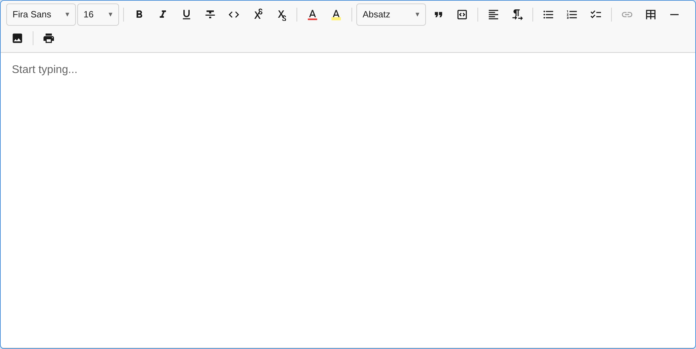

import { Aside, Steps, Tabs, TabItem } from '@astrojs/starlight/components';

This guide walks you through creating a fully-featured rich text editor with toolbar, text formatting, headings, lists, and custom fonts.



## Minimal Editor

The simplest setup — a text editor with bold, italic, and underline:

```ts
import { createEditor } from '@notectl/core';

const editor = await createEditor({
  placeholder: 'Start typing...',
  autofocus: true,
});

document.getElementById('app').appendChild(editor);
```

That's it. The `createEditor` factory auto-registers a `TextFormattingPlugin` with bold, italic, and underline enabled by default.

Runtime styling defaults to strict CSP-safe mode. For CSP policies and nonce wiring, see [Content Security Policy](/notectl/guides/content-security-policy/).

## Full-Featured Editor

The fastest way to get a production editor with all plugins is using `createFullPreset()`:

```ts
import { createEditor, createFullPreset, ThemePreset } from '@notectl/core';

const editor = await createEditor({
  ...createFullPreset(),
  theme: ThemePreset.Light,
  placeholder: 'Start typing...',
  autofocus: true,
});

document.getElementById('app').appendChild(editor);
```

This gives you 8 toolbar groups with all standard plugins (font, text formatting, headings, lists, tables, code blocks, images, and more) plus `HardBreakPlugin` for `Shift+Enter` line breaks.

You can override individual plugin configs:

```ts
const editor = await createEditor({
  ...createFullPreset({
    list: { interactiveCheckboxes: true },
    heading: { levels: [1, 2, 3] },
  }),
  theme: ThemePreset.Dark,
  placeholder: 'Start typing...',
});
```

See the [Plugin Presets](/notectl/guides/presets/) guide for all available options.

## Custom Toolbar Setup

If you need full control over which plugins appear and how they're grouped, configure the toolbar manually:

<Steps>
1. **Import the plugins you need**

   ```ts
   import {
     createEditor,
     TextFormattingPlugin,
     HeadingPlugin,
     ListPlugin,
     LinkPlugin,
     BlockquotePlugin,
     TablePlugin,
     CodeBlockPlugin,
   } from '@notectl/core';
   ```

2. **Configure the toolbar layout**

   The `toolbar` option takes an array of arrays. Each inner array is a visual group separated by dividers:

   ```ts
   const editor = await createEditor({
     toolbar: [
       [new TextFormattingPlugin()],
       [new HeadingPlugin()],
       [new BlockquotePlugin(), new LinkPlugin()],
       [new ListPlugin()],
       [new TablePlugin()],
       [new CodeBlockPlugin()],
     ],
     placeholder: 'Start typing...',
     autofocus: true,
   });
   ```

3. **Add it to the DOM**

   ```ts
   document.getElementById('app').appendChild(editor);
   ```

4. **Listen for changes**

   ```ts
   editor.on('stateChange', ({ newState }) => {
     console.log('Content changed:', newState.doc);
   });

   editor.on('ready', () => {
     console.log('Editor is ready!');
   });
   ```
</Steps>

## HTML Setup

Here's a complete HTML page:

```html
<!DOCTYPE html>
<html lang="en">
<head>
  <meta charset="UTF-8" />
  <meta name="viewport" content="width=device-width, initial-scale=1.0" />
  <title>My Editor</title>
  <style>
    #app {
      max-width: 800px;
      margin: 2rem auto;
    }
    notectl-editor {
      display: block;
      border: 1px solid #e0e0e0;
      border-radius: 8px;
      min-height: 400px;
    }
  </style>
</head>
<body>
  <div id="app"></div>
  <script type="module" src="./main.ts"></script>
</body>
</html>
```

## Reading Content

notectl provides multiple output formats:

```ts
// Get structured JSON (Document model)
const json = editor.getJSON();

// Get sanitized HTML
const html = editor.getContentHTML();

// Get plain text
const text = editor.getText();

// Check if editor is empty
const empty = editor.isEmpty();
```

## Setting Content

```ts
// Set content from HTML
editor.setContentHTML('<h1>Hello</h1><p>Welcome to <strong>notectl</strong>!</p>');

// Set content from JSON (Document model)
editor.setJSON({
  children: [
    {
      type: 'paragraph',
      id: 'block-1',
      children: [{ type: 'text', text: 'Hello world', marks: [] }],
    },
  ],
});
```

## Programmatic Commands

```ts
// Toggle formatting
editor.commands.toggleBold();
editor.commands.toggleItalic();
editor.commands.toggleUnderline();

// Undo / Redo
editor.commands.undo();
editor.commands.redo();

// Execute any registered command by name
editor.executeCommand('toggleStrikethrough');
editor.executeCommand('insertHorizontalRule');
```

<Aside type="tip">
  Check the [Toolbar Configuration](/notectl/guides/toolbar/) guide to learn how to customize the toolbar layout and appearance.
</Aside>

## Framework Integration

Since notectl is a Web Component, it works in any framework:

<Tabs>
  <TabItem label="React">
```tsx
import { useEffect, useRef } from 'react';
import { createEditor } from '@notectl/core';
import type { NotectlEditor } from '@notectl/core';

export function Editor() {
  const containerRef = useRef<HTMLDivElement>(null);
  const editorRef = useRef<NotectlEditor | null>(null);

  useEffect(() => {
    let mounted = true;
    createEditor({
      placeholder: 'Start typing...',
      autofocus: true,
    }).then((editor) => {
      if (mounted && containerRef.current) {
        containerRef.current.appendChild(editor);
        editorRef.current = editor;
      }
    });

    return () => {
      mounted = false;
      editorRef.current?.destroy();
    };
  }, []);

  return <div ref={containerRef} />;
}
```
  </TabItem>
  <TabItem label="Vue">
```vue
<script setup lang="ts">
import { onMounted, onUnmounted, ref } from 'vue';
import { createEditor } from '@notectl/core';
import type { NotectlEditor } from '@notectl/core';

const container = ref<HTMLElement>();
let editor: NotectlEditor | null = null;

onMounted(async () => {
  editor = await createEditor({
    placeholder: 'Start typing...',
    autofocus: true,
  });
  container.value?.appendChild(editor);
});

onUnmounted(() => {
  editor?.destroy();
});
</script>

<template>
  <div ref="container" />
</template>
```
  </TabItem>
  <TabItem label="Svelte">
```svelte
<script lang="ts">
  import { onMount, onDestroy } from 'svelte';
  import { createEditor } from '@notectl/core';
  import type { NotectlEditor } from '@notectl/core';

  let container: HTMLElement;
  let editor: NotectlEditor | null = null;

  onMount(async () => {
    editor = await createEditor({
      placeholder: 'Start typing...',
      autofocus: true,
    });
    container.appendChild(editor);
  });

  onDestroy(() => {
    editor?.destroy();
  });
</script>

<div bind:this={container}></div>
```
  </TabItem>
  <TabItem label="Plain HTML">
```html
<div id="app"></div>

<script type="module">
  import { createEditor } from '@notectl/core';

  const editor = await createEditor({
    placeholder: 'Start typing...',
    autofocus: true,
  });

  document.getElementById('app').appendChild(editor);
</script>
```
  </TabItem>
</Tabs>
