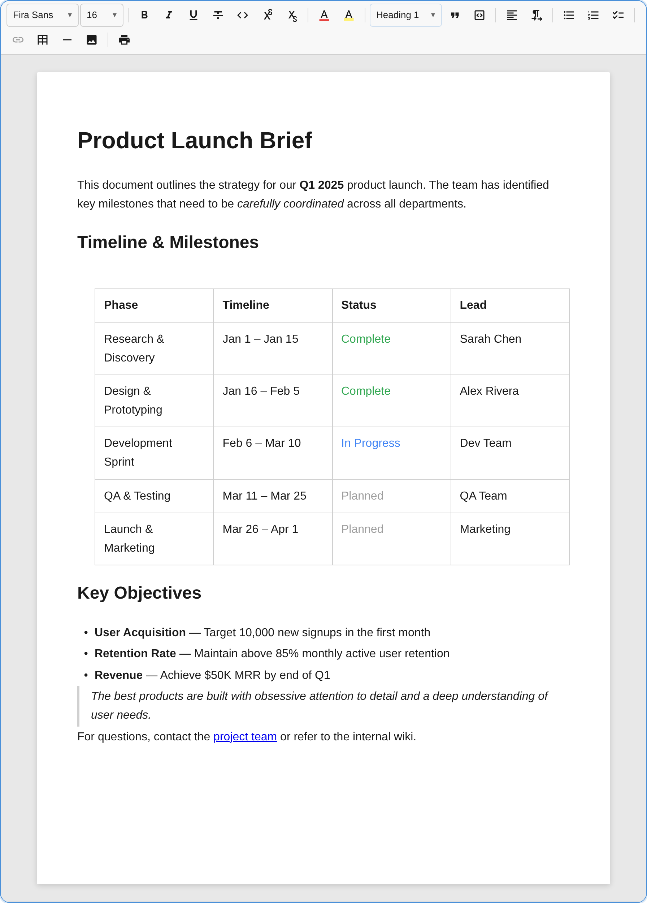
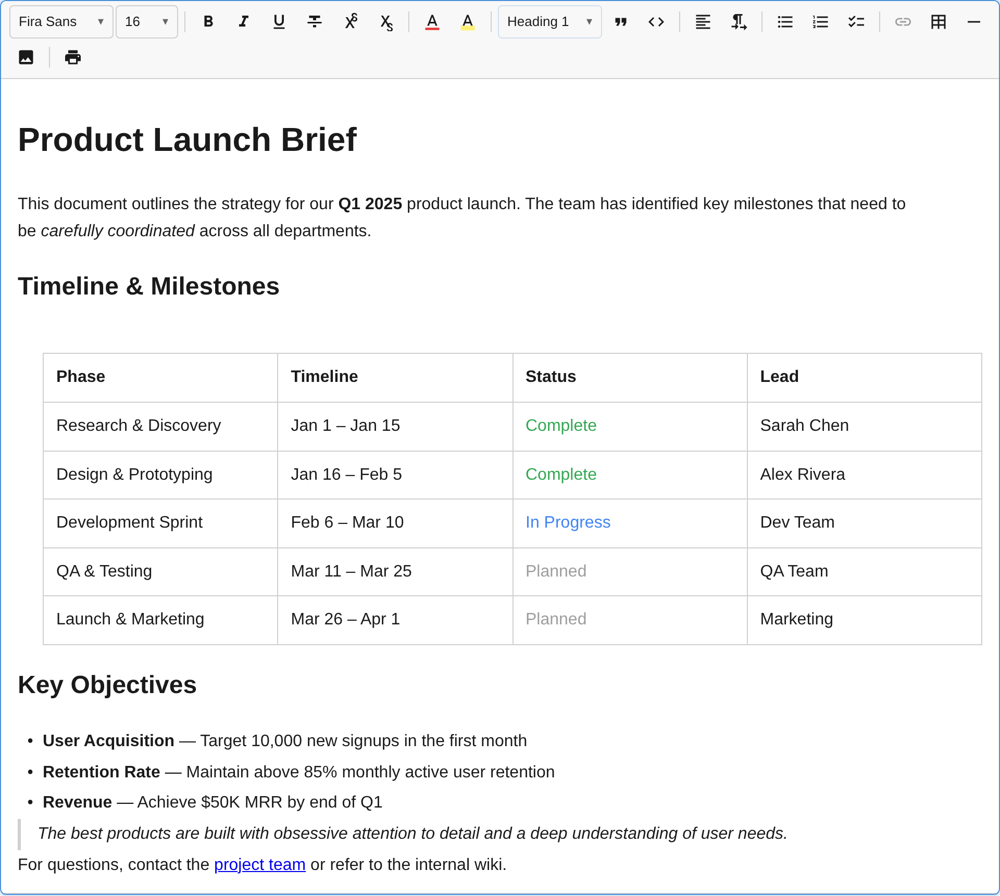

notectl supports configurable paper sizes for WYSIWYG page layout. When `paperSize` is set, the editor content area renders at the exact paper width so that what you see on screen matches the print output 1:1.

## Paper Mode vs Fluid Mode

By default, the editor uses a **fluid layout** that fills its container. When you set a `paperSize`, the editor switches to **paper mode** — the content area takes on the exact paper dimensions, centered on a gray viewport with a page-like shadow.

### Paper Mode (DIN A4)



### Fluid Mode (no paper size)



## Available Paper Sizes

| Preset | Value | Dimensions | Pixels (96 DPI) |
|--------|-------|------------|-----------------|
| `PaperSize.DINA4` | `'din-a4'` | 210 x 297 mm | 794 x 1123 px |
| `PaperSize.DINA5` | `'din-a5'` | 148 x 210 mm | 559 x 794 px |
| `PaperSize.USLetter` | `'us-letter'` | 215.9 x 279.4 mm | 816 x 1056 px |
| `PaperSize.USLegal` | `'us-legal'` | 215.9 x 355.6 mm | 816 x 1344 px |

## Configuration

### At Creation

```ts
import { createEditor, PaperSize } from '@notectl/core';

const editor = await createEditor({
  paperSize: PaperSize.DINA4,
});
```

### HTML Attribute

```html
<notectl-editor paper-size="din-a4"></notectl-editor>
```

### Runtime Change

```ts
// Switch to US Letter
editor.configure({ paperSize: PaperSize.USLetter });

// Read the current paper size
const size = editor.getPaperSize(); // 'us-letter' | undefined
```

## Scale-to-Fit

When the editor's container is narrower than the paper width, the content automatically scales down to fit — similar to how Google Docs behaves. The scale factor is calculated as:

```
scale = min(1, availableWidth / paperWidth)
```

When the container is wider than the paper, the page is centered at full size with no scaling.

## WYSIWYG Print Integration

Paper mode is designed to work seamlessly with the [Print Plugin](/notectl/plugins/print/). When `paperSize` is configured on the editor, it automatically flows into the print output:

- The `@page` CSS rule uses the matching paper size keyword (e.g. `A4`, `letter`)
- Content padding matches exactly between screen and print
- Typography (font family, size, line height) is preserved in the print output

This ensures that line breaks, text flow, and page layout are identical between the editor and the printed document.

```ts
import { createEditor, PaperSize, PrintPlugin } from '@notectl/core';

const editor = await createEditor({
  paperSize: PaperSize.DINA4,
  toolbar: [
    // ... other plugins
    [new PrintPlugin()],
  ],
});

// Print — the paper size is automatically applied
editor.executeCommand('print');
```

You can also override the paper size for a specific print call:

```ts
import { PRINT_SERVICE_KEY } from '@notectl/core';

const printService = editor.getService(PRINT_SERVICE_KEY);
printService.print({ paperSize: PaperSize.USLetter });
```

## Paper Margins

The paper mode uses fixed margins for consistent WYSIWYG layout:

| Constant | Value | Description |
|----------|-------|-------------|
| `PAPER_MARGIN_TOP_PX` | `48px` | Top margin inside the paper surface |
| `PAPER_MARGIN_HORIZONTAL_PX` | `56px` | Left and right margins inside the paper surface |
| `PAPER_VIEWPORT_PADDING_PX` | `24px` | Padding between the viewport edge and the paper |

These are exported from `@notectl/core` for use in custom layouts or print stylesheets.

## Exports

All paper-size-related exports from `@notectl/core`:

| Export | Kind | Description |
|--------|------|-------------|
| `PaperSize` | Const object | `DINA4`, `DINA5`, `USLetter`, `USLegal` |
| `getPaperDimensions(size)` | Function | Returns `PaperDimensions` with mm and px values |
| `getPaperCSSSize(size)` | Function | Returns CSS `@page` size keyword (`'A4'`, `'letter'`, etc.) |
| `PaperDimensions` | Type | `{ widthMm, heightMm, widthPx, heightPx }` |
| `PAPER_MARGIN_TOP_PX` | Constant | Top margin in pixels |
| `PAPER_MARGIN_HORIZONTAL_PX` | Constant | Horizontal margin in pixels |
| `PAPER_VIEWPORT_PADDING_PX` | Constant | Viewport padding in pixels |
