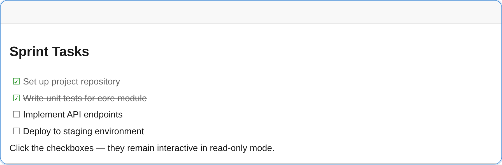

By default, `readonly: true` blocks **all** interaction, including checkbox toggling. To allow users to check/uncheck items while keeping the rest of the editor locked, enable `interactiveCheckboxes` on the `ListPlugin`.



## Setup

Pass `interactiveCheckboxes: true` to the `ListPlugin`:

```ts
import { createEditor, ListPlugin } from '@notectl/core';

const editor = await createEditor({
  readonly: true,
  plugins: [new ListPlugin({ interactiveCheckboxes: true })],
});
document.body.appendChild(editor);
```

Without `interactiveCheckboxes`, checkboxes are fully read-only — just like all other content.

## Toggling at runtime

You can switch between fully read-only and editable mode at any time:

```ts
// Make editable
editor.configure({ readonly: false });

// Make read-only (checkboxes still interactive if configured)
editor.configure({ readonly: true });
```

Or use the HTML attribute for fully read-only (no interactive checkboxes):

```html
<notectl-editor readonly></notectl-editor>
```

## Behavior

| Feature | `readonly: true` | `readonly: true` + `interactiveCheckboxes` |
|---------|-------------------|---------------------------------------------|
| **Toolbar** | Hidden | Hidden |
| **Text editing** | Disabled | Disabled |
| **Text selection** | Allowed | Allowed |
| **Checklist checkboxes** | Disabled | Interactive |

## Use Cases

- **Task management** — Display a project checklist where reviewers can mark items complete without modifying task descriptions.
- **Forms and surveys** — Render a read-only form with toggleable checkbox options.
- **Presentations** — Show a progress checklist that a presenter can check off during a talk.

## Programmatic Access

The `toggleChecklistItem` command respects the same readonly guard. With `interactiveCheckboxes` enabled, it works even in read-only mode:

```ts
// Toggle the checklist item at the current selection
editor.executeCommand('toggleChecklistItem');

// Read the full document state
const doc = editor.getJSON();
```
