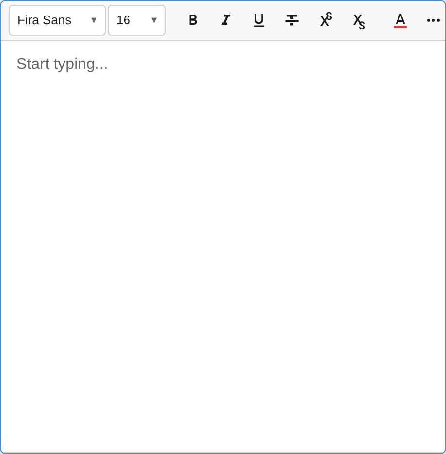
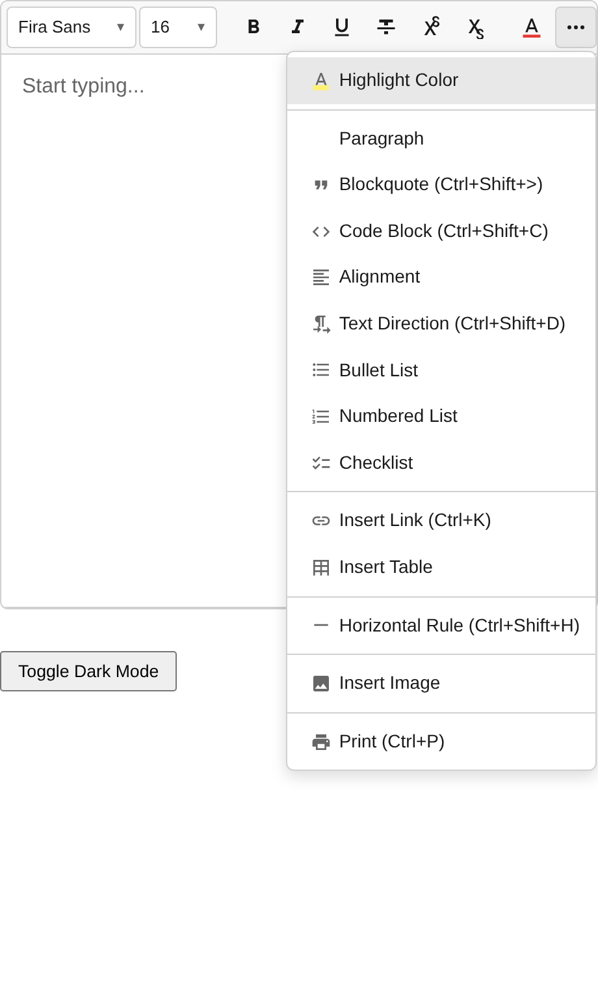
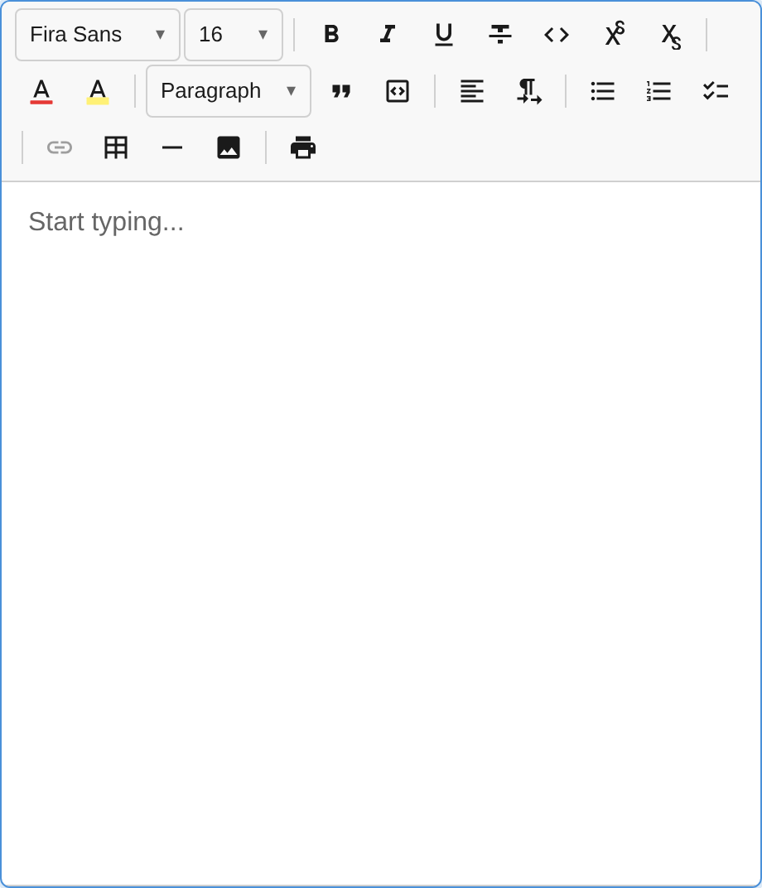

import { Aside } from '@astrojs/starlight/components';

The notectl toolbar is fully declarative. You configure it by passing a `toolbar` option to `createEditor()` — an array of plugin groups that maps directly to the visual layout.

<Aside type="tip">
  Want all plugins with sensible defaults? Use `createFullPreset()` instead of manual configuration. See the [Plugin Presets](/notectl/guides/presets/) guide.
</Aside>


## Basic Setup

The `toolbar` option is an array of arrays. Each inner array represents a visual group of toolbar buttons, with separators rendered between groups:

```ts
import {
  createEditor,
  TextFormattingPlugin,
  HeadingPlugin,
  ListPlugin,
} from '@notectl/core';

const editor = await createEditor({
  toolbar: [
    [new TextFormattingPlugin()],   // Group 1: B, I, U
    [new HeadingPlugin()],          // Group 2: Heading dropdown
    [new ListPlugin()],             // Group 3: List buttons
  ],
});
```

The order of groups and plugins within groups determines their visual order in the toolbar.

## How It Works

When you provide a `toolbar` config:

1. A `ToolbarPlugin` is automatically created with the group layout
2. Each plugin in the toolbar arrays is registered with the editor
3. Plugins register their toolbar items during `init()`
4. The ToolbarPlugin renders buttons in the order defined by your groups

<Aside type="caution">
When using `toolbar`, do **not** also add those plugins to the `plugins` array — they are registered automatically.
</Aside>

## Without Toolbar

If you don't need a toolbar (headless mode), use the `plugins` array directly:

```ts
const editor = await createEditor({
  plugins: [
    new TextFormattingPlugin(),
    new HeadingPlugin(),
    new ListPlugin(),
  ],
});
```

In this mode, no toolbar UI is rendered. You control formatting through the command API:

```ts
editor.executeCommand('toggleBold');
editor.executeCommand('setHeading1');
```

## Mixing Toolbar and Extra Plugins

You can use `toolbar` for visible plugins and `plugins` for background plugins that don't need toolbar UI:

```ts
const editor = await createEditor({
  toolbar: [
    [new TextFormattingPlugin()],
    [new HeadingPlugin()],
  ],
  plugins: [
    myCustomMiddlewarePlugin,
    myAnalyticsPlugin,
  ],
});
```

## Full Toolbar Example

Here's a complete toolbar setup with all built-in plugins organized into logical groups:

```ts
import {
  createEditor,
  TextFormattingPlugin,
  HeadingPlugin,
  BlockquotePlugin,
  LinkPlugin,
  ListPlugin,
  TablePlugin,
  CodeBlockPlugin,
  HorizontalRulePlugin,
  StrikethroughPlugin,
  SuperSubPlugin,
  HighlightPlugin,
  TextColorPlugin,
  AlignmentPlugin,
  FontPlugin,
  FontSizePlugin,
  ImagePlugin,
  HardBreakPlugin,
} from '@notectl/core';
import { STARTER_FONTS } from '@notectl/core/fonts';

const editor = await createEditor({
  toolbar: [
    // Text formatting: Bold, Italic, Underline
    [new TextFormattingPlugin({ bold: true, italic: true, underline: true })],
    // Block types: Paragraph / Heading selector
    [new HeadingPlugin()],
    // Block elements
    [new BlockquotePlugin(), new LinkPlugin()],
    // Lists: Ordered and Unordered
    [new ListPlugin()],
    // Tables and Images
    [new TablePlugin(), new ImagePlugin()],
    // Code blocks
    [new CodeBlockPlugin()],
    // Additional inline formatting
    [
      new HorizontalRulePlugin(),
      new StrikethroughPlugin(),
      new SuperSubPlugin(),
      new HighlightPlugin(),
      new TextColorPlugin(),
    ],
    // Typography: Alignment, Font, Size
    [
      new AlignmentPlugin(),
      new FontPlugin({ fonts: [...STARTER_FONTS] }),
      new FontSizePlugin({ sizes: [12, 16, 24, 32, 48], defaultSize: 16 }),
    ],
  ],
  plugins: [new HardBreakPlugin()], // No toolbar UI needed
  placeholder: 'Start typing...',
  autofocus: true,
});
```

## Responsive Overflow Behavior

When the viewport is too narrow to display all toolbar items, notectl can handle the overflow automatically. Three modes are available via `ToolbarOverflowBehavior`:

### `BurgerMenu` (Default)

Items that don't fit are hidden behind a **"..."** dropdown button. The overflow controller measures available width using a `ResizeObserver` and redistributes items dynamically.



Click the "..." button to reveal the hidden items in a dropdown menu:



```ts
import { createEditor, ToolbarOverflowBehavior } from '@notectl/core';

const editor = await createEditor({
  toolbar: {
    groups: [
      [new TextFormattingPlugin()],
      [new HeadingPlugin()],
      [new ListPlugin()],
    ],
    overflow: ToolbarOverflowBehavior.BurgerMenu, // default
  },
});
```

### `Flow`

The toolbar wraps to multiple rows when items overflow. This is a pure CSS solution — no JavaScript measurement is needed.



```ts
const editor = await createEditor({
  toolbar: {
    groups: [
      [new TextFormattingPlugin()],
      [new HeadingPlugin()],
      [new ListPlugin()],
    ],
    overflow: ToolbarOverflowBehavior.Flow,
  },
});
```

### `None`

No responsive behavior. Items that exceed the container width are clipped. Use this when you control the layout externally or know the toolbar will always fit.

```ts
const editor = await createEditor({
  toolbar: {
    groups: [[new TextFormattingPlugin()]],
    overflow: ToolbarOverflowBehavior.None,
  },
});
```

<Aside type="tip">
You can also use the shorthand array syntax (`toolbar: [[...], [...]]`) — it defaults to `BurgerMenu` overflow. Switch to the object syntax only when you need a different overflow mode.
</Aside>

## Plugin Priority

Each plugin has a `priority` number that determines its rendering order within a toolbar group. Lower numbers render first. You generally don't need to worry about this — the defaults produce a natural ordering.

| Plugin | Default Priority |
|--------|-----------------|
| HardBreakPlugin | 10 |
| TextFormattingPlugin | 20 |
| FontSizePlugin | 21 |
| FontPlugin | 22 |
| StrikethroughPlugin | 22 |
| SuperSubPlugin | 23 |
| TextColorPlugin | 23 |
| HighlightPlugin | 24 |
| LinkPlugin | 25 |
| HeadingPlugin | 30 |
| BlockquotePlugin | 35 |
| ListPlugin | 35 |
| CodeBlockPlugin | 36 |
| HorizontalRulePlugin | 40 |
| TablePlugin | 40 |
| ImagePlugin | 45 |
| AlignmentPlugin | 90 |
