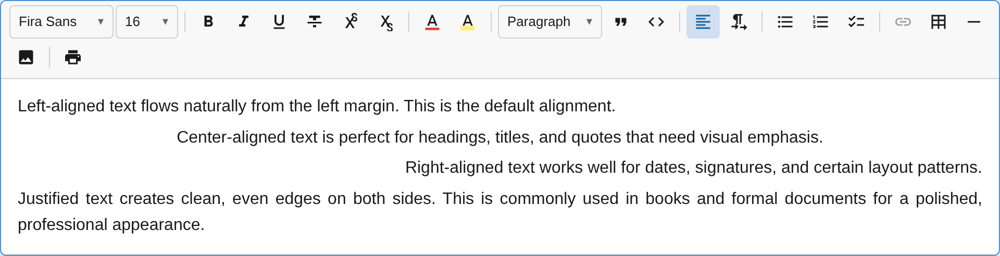

The `AlignmentPlugin` adds text alignment support for paragraphs, headings, and other alignable block types.



## Usage

```ts
import { AlignmentPlugin } from '@notectl/core';

new AlignmentPlugin()
// or restrict alignments:
new AlignmentPlugin({ alignments: ['left', 'center', 'right'] })
```

## Configuration

```ts
interface AlignmentConfig {
  /** Enabled alignment options. Default: ['left', 'center', 'right', 'justify'] */
  readonly alignments: readonly BlockAlignment[];
  /** Block types that support alignment. Default: ['paragraph', 'heading', 'title', 'subtitle', 'table_cell', 'image'] */
  readonly alignableTypes: readonly string[];
  /** Per-type default alignment. E.g. { image: 'center' } */
  readonly defaults: Readonly<Record<string, BlockAlignment>>;
  /** Render separator after toolbar item. */
  readonly separatorAfter?: boolean;
}

type BlockAlignment = 'left' | 'center' | 'right' | 'justify';
```

### Example: No justify

```ts
new AlignmentPlugin({
  alignments: ['left', 'center', 'right'],
})
```

### Example: Custom alignable types

```ts
new AlignmentPlugin({
  alignableTypes: ['paragraph', 'heading', 'blockquote'],
})
```

## Commands

| Command | Description | Returns |
|---------|-------------|---------|
| `alignLeft` | Align text left | `boolean` |
| `alignCenter` | Center text | `boolean` |
| `alignRight` | Align text right | `boolean` |
| `alignJustify` | Justify text | `boolean` |

```ts
editor.executeCommand('alignCenter');
editor.executeCommand('alignLeft');
```

## Keyboard Shortcuts

| Shortcut | Action |
|----------|--------|
| `Ctrl+Shift+L` / `Cmd+Shift+L` | Align left |
| `Ctrl+Shift+E` / `Cmd+Shift+E` | Align center |
| `Ctrl+Shift+R` / `Cmd+Shift+R` | Align right |
| `Ctrl+Shift+J` / `Cmd+Shift+J` | Justify |

## Toolbar

The alignment plugin renders as a **dropdown button** with alignment icons. The currently active alignment is highlighted. Only alignments listed in the `alignments` config appear in the dropdown.

## Middleware

The plugin registers transaction middleware that **preserves the `align` attribute** when a block's type changes (e.g., paragraph to heading). This ensures alignment survives block type transformations.

## Node Attribute

The plugin patches existing node specs to add an `align` attribute:

| Attribute | Type | Default | Renders As |
|-----------|------|---------|-----------|
| `align` | `string` | `'left'` | `style="text-align: center"` |

When alignment is `'left'` (the default), no inline style is added to keep the DOM clean.
