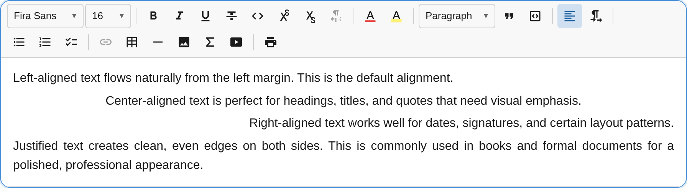

The `AlignmentPlugin` adds text alignment support for paragraphs, headings, and other alignable block types. It uses **logical alignment values** (`start`/`end`) instead of physical values (`left`/`right`) for correct behavior in both LTR and RTL text directions.



## Usage

```ts
import { AlignmentPlugin } from '@notectl/core/plugins/alignment';

new AlignmentPlugin()
// or restrict alignments:
new AlignmentPlugin({ alignments: ['start', 'center', 'end'] })
```

## Configuration

```ts
interface AlignmentConfig {
  /** Enabled alignment options. Default: ['start', 'center', 'end', 'justify'] */
  readonly alignments: readonly BlockAlignment[];
  /** Block types that support alignment. Default: ['paragraph', 'heading', 'title', 'subtitle', 'table_cell', 'image'] */
  readonly alignableTypes: readonly string[];
  /** Per-type default alignment. E.g. { image: 'center' } */
  readonly defaults: Readonly<Record<string, BlockAlignment>>;
  /** Your own CSS class per alignment in HTML content. See "Custom CSS Classes". */
  readonly classNames?: AlignmentClassNames;
  /** Custom locale strings. */
  readonly locale?: AlignmentLocale;
}

type BlockAlignment = 'start' | 'center' | 'end' | 'justify';
type AlignmentClassNames = Readonly<Partial<Record<BlockAlignment, string>>>;
```

### Logical Values and RTL Support

The plugin uses CSS logical values instead of physical directions:

| Logical Value | In LTR | In RTL |
|--------------|--------|--------|
| `start` | Left-aligned | Right-aligned |
| `end` | Right-aligned | Left-aligned |
| `center` | Centered | Centered |
| `justify` | Justified | Justified |

This ensures alignment works correctly regardless of text direction. When combined with the [TextDirectionPlugin](/notectl/plugins/text-direction/), alignment automatically adapts to the block's direction.

### Example: No justify

```ts
new AlignmentPlugin({
  alignments: ['start', 'center', 'end'],
})
```

### Example: Custom alignable types

```ts
new AlignmentPlugin({
  alignableTypes: ['paragraph', 'heading', 'blockquote'],
})
```

## Custom CSS Classes

By default, [class-based HTML export](/notectl/guides/content-security-policy/#class-based-html-export-zero-inline-styles)
writes alignment as `notectl-align-center` and similar classes. If your application already has
classes for alignment, for example from a CMS, a design system or a previous editor, configure
them once with `classNames`:

```ts
import { AlignmentPlugin } from '@notectl/core/plugins/alignment';

new AlignmentPlugin({
  classNames: {
    center: 'align-center',
    end: 'align-end',
    justify: 'align-justify',
  },
});

// With the full preset:
createFullPreset({ alignment: { classNames: { center: 'align-center' } } });
```

Every HTML boundary of the editor then uses your classes:

```ts
const { html, css, styleMap } = await editor.getContentHTML({
  cssMode: 'classes', includeBlockIds: false,
});
// html:     <p class="align-center">Centered text</p>
// css:      .align-center { text-align: center; }
// styleMap: Map { 'align-center' => 'text-align: center' }

await editor.setContentHTML(html); // no styleMap needed: the alignment is restored
```

- **Export** (`getContentHTML({ cssMode: 'classes' })`) writes your class instead of
  `notectl-align-*`. The returned `css` and `styleMap` contain the same class names as `html`, so
  the result renders on its own and re-imports anywhere through the `styleMap`.
- **Import and paste** recognize your classes directly, including paragraphs, headings, images
  and table cells. A pasted paragraph's explicit alignment applies to the destination when it
  supports alignment, preserving its block type and unrelated attributes such as text direction.
  Unformatted inline paste keeps the destination's formatting.
  Content with notectl's default classes still imports and is written with your classes on the
  next export, which makes switching an existing store over a matter of re-saving.
- **The document stays semantic.** The editor stores `align: 'center'`, never a class name.
  `classNames` is initialization configuration. Recreating the editor with another mapping changes
  the exported names without changing the semantic alignment stored in your JSON document.
- **Alignments without a class** keep notectl's default names, so you can map only the ones your
  stylesheet knows.
- **Inline export is unchanged.** The default `getContentHTML()` keeps writing
  `style="text-align: …"`, so self-contained HTML (for example for emails) works as before.

### Start Alignment

`start` is the default alignment and browsers render it without any CSS, so notectl leaves it out
of the HTML. Map `start` only when your stylesheet needs it explicitly, for example because your
content area is justified by default:

```ts
new AlignmentPlugin({
  classNames: { start: 'align-start', center: 'align-center', end: 'align-end' },
});
```

With a `start` class, start-aligned blocks outside an aligned container get that class, whether
they were aligned to start explicitly or never aligned at all. Setting a centered block back to
start replaces `align-center` with `align-start`.

Inside an aligned container, such as a centered table cell, blocks **without their own alignment**
inherit the container's alignment in both the editor and the exported HTML. An **explicit** `start`,
whether imported or set with `alignStart`, overrides the container and keeps its class on export.
Without a configured `start` class, export writes `notectl-align-start` in class mode or an inline
`text-align: start` in inline mode so that the override also survives re-import.

```html
<td class="… align-center">
  <p>Centered by the cell</p>
  <p class="align-start">Explicitly start-aligned</p>
</td>
```

### Right-to-Left Content

Alignment in notectl is logical: `start` and `end` follow the text direction. Write the CSS for
your classes with logical values, as notectl's generated CSS does:

```css
.align-start   { text-align: start; }   /* left in LTR, right in RTL */
.align-center  { text-align: center; }
.align-end     { text-align: end; }     /* right in LTR, left in RTL */
.align-justify { text-align: justify; }
```

A class with physical CSS such as `.align-left { text-align: left; }` matches `start` only in
left-to-right text. If you map `start` to it, start-aligned right-to-left blocks render on the wrong
side. For the same reason the keys are always logical: `{ left: 'align-left' }` is rejected with a
hint to use `start`.

### Images, Videos and Table Cells

The class goes on the element that carries the alignment in exported HTML:

| Block | Element with the class |
|-------|------------------------|
| Paragraph, heading, title, subtitle | The block element itself (`<p>`, `<h2>`, …) |
| Image | The `<figure>` wrapper around the `` |
| Video | The `<figure>` of the [exported video](/notectl/plugins/video/#html-export) |
| Table cell | The `<td>`; import also reads `<th>` |

Images and videos are centered by default. One aligned to the start is therefore exported with the
`start` class, or with `notectl-align-start` when `start` has no class, so that importing the HTML
restores it. Videos are aligned with the VideoPlugin's own controls and use the same classes.

### Rendering in the Editor

The classes describe your exported content. They do not change how the editor renders: inside its
Shadow DOM the editor applies alignment itself, CSP-safe and without your stylesheet. Load your
stylesheet, or the returned `css`, where you display the exported HTML. See
[Using Your Own Class Names](/notectl/guides/content-security-policy/#using-your-own-class-names)
for a complete example.

### Rules for Class Names

The editor checks `classNames` when it initializes. An invalid configuration makes `createEditor()`
(or `init()`) reject with a `TypeError` that names the problem and the fix:

- Keys are `start`, `center`, `end` and `justify`.
- Each value is one CSS class name of letters, digits, `-` and `_` that does not start with a digit.
  Selectors that need escaping (`md:text-center`) and lists of classes (`'a b'`) are not supported.
- The prefix `notectl-` is reserved for the classes notectl generates.
- Each alignment needs its own class; otherwise import could not tell them apart.

Custom classes cover block alignment. Text colors, highlights, fonts and font sizes keep their
generated `notectl-s-*` classes in class-based export.

## Commands

| Command | Description | Returns |
|---------|-------------|---------|
| `alignStart` | Align text to start (left in LTR, right in RTL) | `boolean` |
| `alignCenter` | Center text | `boolean` |
| `alignEnd` | Align text to end (right in LTR, left in RTL) | `boolean` |
| `alignJustify` | Justify text | `boolean` |

```ts
editor.executeCommand('alignCenter');
editor.executeCommand('alignStart');
```

## Keyboard Shortcuts

| Shortcut | Action |
|----------|--------|
| `Ctrl+Shift+L` / `Cmd+Shift+L` | Align start |
| `Ctrl+Shift+E` / `Cmd+Shift+E` | Align center |
| `Ctrl+Shift+R` / `Cmd+Shift+R` | Align end |
| `Ctrl+Shift+J` / `Cmd+Shift+J` | Justify |

## Toolbar

The alignment plugin renders as a **dropdown button** with alignment icons. The currently active alignment is highlighted. Only alignments listed in the `alignments` config appear in the dropdown.

## Middleware

The plugin registers transaction middleware that **preserves the `align` attribute** when a block's type changes (e.g., paragraph to heading). This ensures alignment survives block type transformations.

## Node Attribute

The plugin patches existing node specs to add an `align` attribute:

| Attribute | Type | Default | Exported As |
|-----------|------|---------|-----------|
| `align` | `string` | `'start'` | `style="text-align: center"`, or in class mode `class="notectl-align-center"` / your class |

When alignment is `'start'` (the default), nothing is added to keep the HTML clean, unless the
block's own default differs (images are centered) or `start` has a [custom class](#start-alignment).
