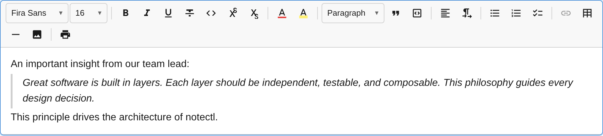

The `BlockquotePlugin` adds block quote support with a toggle command, keyboard shortcut, and Markdown-style input rule.



## Usage

```ts
import { BlockquotePlugin } from '@notectl/core';

new BlockquotePlugin()
```

## Configuration

```ts
interface BlockquoteConfig {
  /** Render separator after toolbar item. */
  readonly separatorAfter?: boolean;
}
```

## Commands

| Command | Description | Returns |
|---------|-------------|---------|
| `toggleBlockquote` | Toggle blockquote on/off for the current block | `boolean` |
| `setBlockquote` | Convert the current block to blockquote | `boolean` |

```ts
editor.executeCommand('toggleBlockquote');
```

## Keyboard Shortcuts

| Shortcut | Action |
|----------|--------|
| `Ctrl+Shift+>` / `Cmd+Shift+>` | Toggle blockquote |

## Input Rules

| Pattern | Result |
|---------|--------|
| `> ` (at the start of a line) | Convert to blockquote |

## Node Spec

| Type | HTML Tag | Description |
|------|----------|-------------|
| `blockquote` | `<blockquote>` | Block-level quote container |

The `toDOM` method creates a `<blockquote>` element with the required `data-block-id` attribute. The editor's default styles render a left border and padding for visual distinction.
