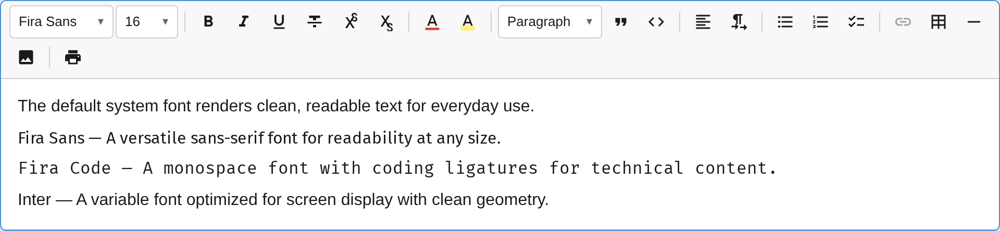

The `FontPlugin` provides a font family selector with automatic `@font-face` CSS injection for custom fonts (WOFF2, TTF, OTF).



For a complete guide on using custom fonts, see [Custom Fonts](/notectl/guides/custom-fonts/).

## Usage

```ts
import { FontPlugin } from '@notectl/core';
import { STARTER_FONTS } from '@notectl/core/fonts';

new FontPlugin({
  fonts: [...STARTER_FONTS],
})
```

## Configuration

```ts
interface FontConfig {
  /** Fonts available in the editor. */
  readonly fonts: FontDefinition[];
  /** Name of the default font. Selecting it removes the mark. */
  readonly defaultFont?: string;
  /** Render separator after toolbar item. */
  readonly separatorAfter?: boolean;
}

interface FontDefinition {
  /** Display name in toolbar dropdown. */
  readonly name: string;
  /** CSS font-family value. */
  readonly family: string;
  /** Category for grouping in the picker. */
  readonly category?: 'serif' | 'sans-serif' | 'monospace' | 'display' | 'handwriting';
  /** @font-face descriptors for auto-injection. */
  readonly fontFaces?: FontFaceDescriptor[];
}

interface FontFaceDescriptor {
  /** CSS src value (e.g., "url('/fonts/Inter.woff2') format('woff2')"). */
  readonly src: string;
  /** Weight (e.g., '400' or '100 900' for variable fonts). */
  readonly weight?: string;
  /** Style (e.g., 'normal' or 'italic'). */
  readonly style?: string;
  /** Display strategy. Default: 'swap'. */
  readonly display?: string;
}
```

## Starter Fonts

Built-in fonts with embedded WOFF2 data (no external URLs needed):

```ts
import { STARTER_FONTS, FIRA_CODE, FIRA_SANS } from '@notectl/core/fonts';
```

| Constant | Font | Category | Weights |
|----------|------|----------|---------|
| `FIRA_SANS` | Fira Sans | sans-serif | 400, 700 |
| `FIRA_CODE` | Fira Code | monospace | 400 |
| `STARTER_FONTS` | Both of the above | - | - |

## Commands

| Command | Description | Returns |
|---------|-------------|---------|
| `setFont` | Reserved — font is applied via the toolbar popup | `false` |
| `removeFont` | Remove font mark from selection (reset to default) | `boolean` |

## Toolbar

The font plugin renders as a **combobox-style selector**. The label updates to show the active font name at the cursor position. Clicking opens a font picker popup where each font name is rendered in its own typeface for instant preview.

## Mark Spec

| Mark | Attributes | Renders As |
|------|-----------|-----------|
| `font` | `family: string` | `<span style="font-family: ...">` |

## Default Font Behavior

When the user selects the `defaultFont`, the font mark is **removed** rather than applied. This keeps the document clean — text in the default font has no unnecessary marks.

## Custom Font Example

```ts
import { FontPlugin } from '@notectl/core';
import { STARTER_FONTS } from '@notectl/core/fonts';
import type { FontDefinition } from '@notectl/core';

const INTER: FontDefinition = {
  name: 'Inter',
  family: "'Inter', sans-serif",
  category: 'sans-serif',
  fontFaces: [
    {
      src: "url('/fonts/Inter-Variable.woff2') format('woff2')",
      weight: '100 900',
      style: 'normal',
    },
  ],
};

new FontPlugin({
  fonts: [...STARTER_FONTS, INTER],
  defaultFont: 'Fira Sans',
})
```

## Google Fonts Example

```ts
const ROBOTO: FontDefinition = {
  name: 'Roboto',
  family: "'Roboto', sans-serif",
  category: 'sans-serif',
  fontFaces: [
    {
      src: "url('https://fonts.gstatic.com/s/roboto/v30/KFOmCnqEu92Fr1Mu4mxK.woff2') format('woff2')",
      weight: '400',
      style: 'normal',
    },
    {
      src: "url('https://fonts.gstatic.com/s/roboto/v30/KFOlCnqEu92Fr1MmWUlfBBc4.woff2') format('woff2')",
      weight: '700',
      style: 'normal',
    },
  ],
};
```
