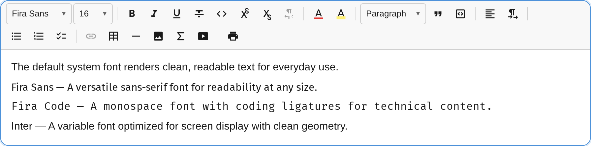

The `FontPlugin` provides a font family selector with automatic `@font-face` CSS injection for custom fonts (WOFF2, TTF, OTF).



For a complete guide on using custom fonts, see [Custom Fonts](/notectl/guides/custom-fonts/).

## Usage

```ts
import { FontPlugin } from '@notectl/core/plugins/font';
import { STARTER_FONTS } from '@notectl/core/fonts/starter';

new FontPlugin({
  fonts: [...STARTER_FONTS],
})
```

## Configuration

```ts
interface FontConfig {
  /** Fonts available in the editor. */
  readonly fonts: FontDefinition[];
  /** Name of the default font. Selecting it removes the mark. */
  readonly defaultFont?: string;
  /** Your own CSS class per font name in class-based HTML. See "Custom CSS Classes". */
  readonly styleClasses?: Readonly<Record<string, string>>;
  /** Custom locale strings. */
  readonly locale?: FontLocale;
}

interface FontDefinition {
  /** Display name in toolbar dropdown. */
  readonly name: string;
  /** CSS font-family value. */
  readonly family: string;
  /** Category for grouping in the picker. */
  readonly category?: 'serif' | 'sans-serif' | 'monospace' | 'display' | 'handwriting';
  /** @font-face descriptors for auto-injection. */
  readonly fontFaces?: FontFaceDescriptor[];
}

interface FontFaceDescriptor {
  /** CSS src value (e.g., "url('/fonts/Inter.woff2') format('woff2')"). */
  readonly src: string;
  /** Weight (e.g., '400' or '100 900' for variable fonts). */
  readonly weight?: string;
  /** Style (e.g., 'normal' or 'italic'). */
  readonly style?: string;
  /** Display strategy. Default: 'swap'. */
  readonly display?: string;
}
```

## Custom CSS Classes

[Class-based HTML export](/notectl/guides/content-security-policy/#class-based-html-export-zero-inline-styles)
writes fonts as generated `notectl-s-*` classes. Map your fonts to the classes of your stylesheet
with `styleClasses`, keyed by the font's `name`:

```ts
new FontPlugin({
  fonts: [
    { name: 'Inter', family: "'Inter', sans-serif" },
    { name: 'Fira Code', family: "'Fira Code', monospace" },
  ],
  styleClasses: { Inter: 'font-sans', 'Fira Code': 'font-mono' },
});
// Exported: <span class="font-mono">…</span>
```

Keys must name fonts in `fonts`; an unknown name is rejected with the list of configured fonts.
Browsers requote font names on import (`'Inter'` may come back as `Inter`), and the next export
still finds your class. See [Custom CSS Classes](/notectl/guides/custom-css-classes/) for the rules shared by all formatting plugins.

## Starter Fonts

Built-in fonts with embedded WOFF2 data (no external URLs needed):

```ts
import { STARTER_FONTS, FIRA_CODE, FIRA_SANS } from '@notectl/core/fonts/starter';
```

| Constant | Font | Category | Weights |
|----------|------|----------|---------|
| `FIRA_SANS` | Fira Sans | sans-serif | 400 |
| `FIRA_CODE` | Fira Code | monospace | 400 |
| `STARTER_FONTS` | Both of the above | - | - |

## Commands

| Command | Description | Returns |
|---------|-------------|---------|
| `setFont` | Reserved — font is applied via the toolbar popup | `false` |
| `removeFont` | Remove font mark from selection (reset to default) | `boolean` |

## Toolbar

The font plugin renders as a **combobox-style selector**. The label updates to show the active font name at the cursor position. Clicking opens a font picker popup where each font name is rendered in its own typeface for instant preview.

The picker also selects fonts from imported or pasted HTML. Browsers change the quotes of font family names (Chromium reads `'Inter', sans-serif` back as `Inter, sans-serif`), so notectl stores an imported family that matches one of your `fonts` in its configured spelling.

## Mark Spec

| Mark | Attributes | Renders As |
|------|-----------|-----------|
| `font` | `family: string` | `<span style="font-family: ...">` |

## Default Font Behavior

When the user selects the `defaultFont`, the font mark is **removed** rather than applied. This keeps the document clean — text in the default font has no unnecessary marks.

## Custom Font Example

```ts
import { FontPlugin } from '@notectl/core/plugins/font';
import { STARTER_FONTS } from '@notectl/core/fonts/starter';
import type { FontDefinition } from '@notectl/core/plugins/font';

const INTER: FontDefinition = {
  name: 'Inter',
  family: "'Inter', sans-serif",
  category: 'sans-serif',
  fontFaces: [
    {
      src: "url('/fonts/Inter-Variable.woff2') format('woff2')",
      weight: '100 900',
      style: 'normal',
    },
  ],
};

new FontPlugin({
  fonts: [...STARTER_FONTS, INTER],
  defaultFont: 'Fira Sans',
})
```

## Google Fonts Example

```ts
const ROBOTO: FontDefinition = {
  name: 'Roboto',
  family: "'Roboto', sans-serif",
  category: 'sans-serif',
  fontFaces: [
    {
      src: "url('https://fonts.gstatic.com/s/roboto/v30/KFOmCnqEu92Fr1Mu4mxK.woff2') format('woff2')",
      weight: '400',
      style: 'normal',
    },
    {
      src: "url('https://fonts.gstatic.com/s/roboto/v30/KFOlCnqEu92Fr1MmWUlfBBc4.woff2') format('woff2')",
      weight: '700',
      style: 'normal',
    },
  ],
};
```
