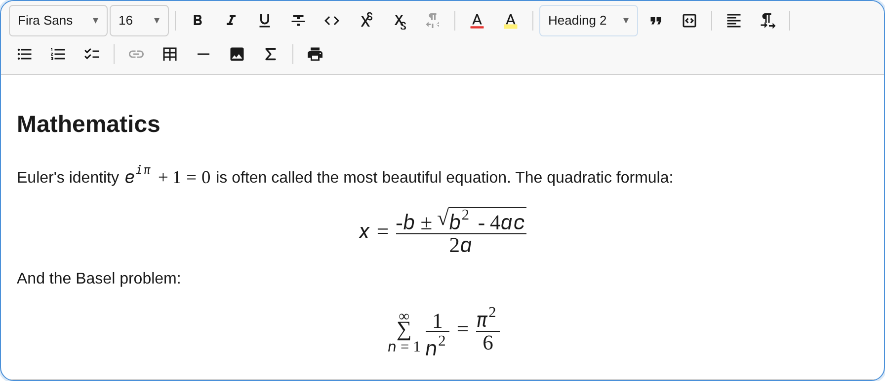

The `FormulaPlugin` adds inline and block (display) math to notectl. It is built on three principles that set it apart from every KaTeX or MathJax based editor:

1. **Zero dependencies.** Formulas render through the browser's own native MathML engine. notectl ships no math rendering library, so the single-runtime-dependency promise (`dompurify`) stays intact.
2. **Accessibility first.** The stored format is MathML, which is exactly what screen readers (NVDA with MathCAT, JAWS, VoiceOver) consume natively. Accessibility is structural, not bolted on.
3. **Two ways to author, one canonical format.** Type LaTeX with a live preview, or build expressions with an accessible structural palette. Both produce the same MathML.



## Usage

```ts
import { FormulaPlugin } from '@notectl/core/plugins/formula';
import { NOTECTL_MATH_FONT } from '@notectl/core/fonts';

// Recommended: pass the bundled OpenType MATH font for correct rendering in Chromium.
new FormulaPlugin({ mathFont: NOTECTL_MATH_FONT });
```

The plugin is included in the full preset:

```ts
import { createFullPreset } from '@notectl/core/presets/full';
import { NOTECTL_MATH_FONT } from '@notectl/core/fonts';

const preset = createFullPreset({
  formula: { mathFont: NOTECTL_MATH_FONT },
});
```

## The bundled MATH font

Firefox and Safari render MathML with the system OpenType MATH font. Chromium ships none, so without one it draws stretchy constructs incorrectly: matrix brackets stay flat, large integrals, roots, and summations are not enlarged.

notectl solves this with a bundled font, `NOTECTL_MATH_FONT`, a subset of Noto Sans Math (SIL OFL 1.1). It is exported from the `./fonts` subpath so its payload stays out of the main bundle, and it is opt-in. Pass it to the plugin and the formula styles apply `font-family: 'Notectl Math', math` to every formula, which fixes the Chromium rendering. It is a self-hosted font asset, not an npm dependency.

## Inserting formulas

- **Toolbar button** (group `insert`): opens a popup with a LaTeX field, a live preview, an accessible structural palette, and a display toggle.
- **Input rules:** type `$x^2$` for inline math and `$$\int_0^1 x\,dx$$` for a display equation. The closing delimiter triggers the conversion.
- **Keyboard:** `Mod+Shift+E` opens the inline editor at the cursor, `Mod+Shift+M` opens the display editor.

## Editing existing formulas

- Click an inline formula to open its editor.
- Double-click a display formula, or select it and press `Enter`.
- With the caret next to an inline formula, `Mod+Shift+E` edits it instead of inserting a new one.

Edits commit as a single transaction, so undo and redo work out of the box.

## Sizing formulas

Every formula has a **Size** control in its editor. Open a formula (click an inline formula, or double-click a display formula) and pick a size next to the LaTeX field. The live preview reflects the choice immediately. This is the most direct way to resize a single formula, and it works the same for inline and display. The size is stored as a node attribute, so it survives undo, redo, and later LaTeX edits.

Formulas also honour the toolbar's **Font Size** control. Select a formula (a display formula via the gap cursor, an inline formula via Shift and arrow keys) or a range that includes formulas, such as Select All, then pick a size. MathML inherits the font size, so fractions, roots, and matrices enlarge proportionally. Both paths write the same `fontSize` node attribute, so they stay consistent. The toolbar integration is generic: any node that declares a `fontSize` attribute participates, not just formulas.

## Authoring methods

### LaTeX field

The primary authoring surface is a LaTeX text field with a live MathML preview. It is linear, keyboard friendly, and screen-reader friendly. Unknown commands are surfaced visibly and announced through a live region rather than silently dropped.

### Structural palette

For non-experts, an accessible palette (an ARIA toolbar with a roving tabindex) inserts common structures at the caret: fractions, roots, scripts, big operators, Greek letters, relations, arrows, and matrices. Every button has an accessible label and is reachable by keyboard alone.

## Storage and interoperability

Each formula stores MathML as the canonical attribute, with the LaTeX source embedded as a TeX annotation for lossless re-editing:

```xml
<math display="inline">
  <semantics>
    <mrow>...</mrow>
    <annotation encoding="application/x-tex">e^{i\pi} + 1 = 0</annotation>
  </semantics>
</math>
```

Because MathML is the shared language of serious math producers, paste interop comes almost for free. Pasting from a KaTeX page, a MathJax page, a native-MathML source, or Microsoft Word with "Copy MathML" produces an editable, accessible formula. The paste path reads the raw clipboard HTML, extracts the `<math>`, sanitizes it, and reads the embedded LaTeX when present.

## Accessibility

- The stored MathML is the screen-reader surface. No extra configuration is needed.
- Each formula carries a readable fallback label via the native `alttext` attribute for assistive technology that does not process MathML.
- The editor field, palette, and overlay are fully keyboard operable, with ARIA roles and labels, visible focus, and live announcements.
- The insert and edit popup contains keyboard focus: it opens on the LaTeX field, and Tab and Shift+Tab cycle through the palette, LaTeX field, description, size control, display toggle, and action buttons without leaving the popup. Escape closes it.
- Display formulas are selectable by keyboard through the gap cursor; an inline formula selected with Shift and the arrow keys shows the normal selection highlight.

## Supported LaTeX

The bundled converter covers a curated subset of roughly 200 of the most common commands. Math-alphabet commands such as `\mathbb{R}` emit the real Unicode glyph (ℝ) rather than relying on `mathvariant`, which Chromium's MathML Core no longer honours.

- **Structure:** `\frac`, `\dfrac`, `\tfrac`, `\binom`, `\sqrt` (with optional index), superscripts, subscripts, primes.
- **Greek:** lowercase, uppercase, and variant letters.
- **Operators and relations:** `\times`, `\cdot`, `\pm`, `\leq`, `\geq`, `\neq`, `\approx`, `\equiv`, `\in`, `\subseteq`, and many more.
- **Big operators:** `\sum`, `\prod`, `\int`, `\oint`, `\lim`, `\max`, `\min`, with correct limit placement.
- **Delimiters:** `\left ... \right` with stretchy fences, including the null delimiter.
- **Accents:** `\hat`, `\bar`, `\vec`, `\tilde`, `\dot`, `\overline`, `\widehat`, and more.
- **Environments:** `matrix`, `pmatrix`, `bmatrix`, `Bmatrix`, `vmatrix`, `Vmatrix`, `cases`, `aligned`, `array`.
- **Fonts and text:** `\mathbb`, `\mathcal`, `\mathfrak`, `\mathbf`, `\mathit`, `\mathsf`, `\mathtt`, `\mathrm`, `\text`, `\operatorname`.
- **Spacing:** `\,`, `\:`, `\;`, `\!`, `\quad`, `\qquad`.

Unknown commands render as a visible, announced error marker so nothing fails silently.

## Configuration

```ts
interface FormulaPluginConfig {
  /** Locale override for user-facing strings. */
  readonly locale?: FormulaLocale;
  /** Keyboard shortcut overrides. */
  readonly keymap?: {
    readonly insertInline?: string | null;   // default: 'Mod-Shift-E'
    readonly insertDisplay?: string | null;  // default: 'Mod-Shift-M'
  };
  /** Preset px sizes in the editor's size control; pass [] to hide it. */
  readonly fontSizes?: readonly number[];
  /** Bundled OpenType MATH font (import NOTECTL_MATH_FONT from '@notectl/core/fonts'). */
  readonly mathFont?: FontDefinition;
}
```

### Internationalization

Every user-facing string (toolbar label and tooltip, the editor popup, palette group names, and live-region announcements) is translatable. The plugin ships translations for Arabic, German, English, Spanish, French, Hindi, Portuguese, Russian, and Chinese, chosen automatically from the editor's language. Pass a custom `locale` to override individual strings.

## Architecture note

The converter (`latex/`), the MathML helpers (`mathml/`), and the accessible field (`math-field/`) are framework-agnostic with zero notectl imports, so they can be published as a standalone accessible math component and converter library without changes.
