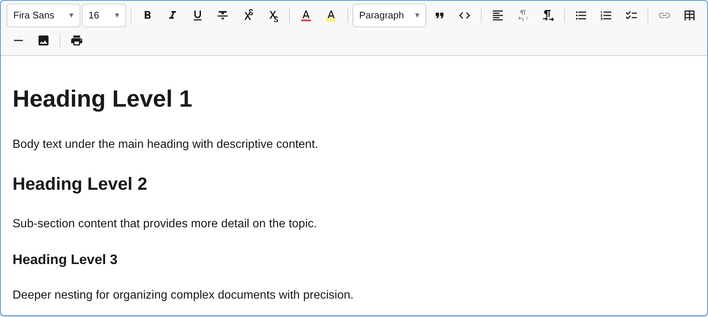

The `HeadingPlugin` adds heading support (H1-H6) with a toolbar dropdown selector, keyboard shortcuts, and Markdown-style input rules.



## Usage

```ts
import { HeadingPlugin } from '@notectl/core';

new HeadingPlugin()
// or with custom config:
new HeadingPlugin({ levels: [1, 2, 3] })
```

## Configuration

```ts
interface HeadingConfig {
  /** Which heading levels to enable. Default: [1, 2, 3, 4, 5, 6] */
  readonly levels: HeadingLevel[];
  /** Render separator after toolbar item. */
  readonly separatorAfter?: boolean;
}

type HeadingLevel = 1 | 2 | 3 | 4 | 5 | 6;
```

### Example: Only H1-H3

```ts
new HeadingPlugin({ levels: [1, 2, 3] })
```

Only the specified levels appear in the dropdown selector and respond to input rules and keyboard shortcuts.

## Commands

| Command | Description | Returns |
|---------|-------------|---------|
| `setHeading1` | Toggle heading level 1 | `boolean` |
| `setHeading2` | Toggle heading level 2 | `boolean` |
| `setHeading3` | Toggle heading level 3 | `boolean` |
| `setHeading4` | Toggle heading level 4 | `boolean` |
| `setHeading5` | Toggle heading level 5 | `boolean` |
| `setHeading6` | Toggle heading level 6 | `boolean` |
| `setParagraph` | Convert block back to paragraph | `boolean` |
| `setTitle` | Set block as title (large H1 variant) | `boolean` |
| `setSubtitle` | Set block as subtitle (large H2 variant) | `boolean` |
| `toggleHeading` | Toggle H1 on current block | `boolean` |

```ts
editor.executeCommand('setHeading2');
editor.executeCommand('setParagraph');
editor.executeCommand('setTitle');
```

Each `setHeadingN` command acts as a toggle: if the block is already that heading level, it reverts to a paragraph.

## Keyboard Shortcuts

| Shortcut | Action |
|----------|--------|
| `Ctrl+Shift+1` / `Cmd+Shift+1` | Heading 1 |
| `Ctrl+Shift+2` / `Cmd+Shift+2` | Heading 2 |
| `Ctrl+Shift+3` / `Cmd+Shift+3` | Heading 3 |
| `Ctrl+Shift+4` / `Cmd+Shift+4` | Heading 4 |
| `Ctrl+Shift+5` / `Cmd+Shift+5` | Heading 5 |
| `Ctrl+Shift+6` / `Cmd+Shift+6` | Heading 6 |

Only shortcuts for configured levels are registered.

## Input Rules

Type at the beginning of an empty line:

| Pattern | Result |
|---------|--------|
| `# ` | Heading 1 |
| `## ` | Heading 2 |
| `### ` | Heading 3 |
| `#### ` | Heading 4 |
| `##### ` | Heading 5 |
| `###### ` | Heading 6 |

Input rules only fire for levels included in the `levels` config.

## Toolbar

The heading plugin renders as a **dropdown selector** in the toolbar. The dropdown label reflects the current block type ("Paragraph", "Heading 1", "Heading 2", etc.). Each option is styled with the corresponding heading font size for visual preview.

### Extending the Block Type Picker

The dropdown is backed by a shared registry. Any plugin can add entries that automatically appear in the picker by calling `registerBlockTypePickerEntry()`:

```ts
import type { Plugin, PluginContext } from '@notectl/core';

class FooterPlugin implements Plugin {
  readonly id = 'footer';
  readonly name = 'Footer';
  readonly dependencies = ['heading']; // ensures picker exists

  init(context: PluginContext): void {
    context.registerNodeSpec({
      type: 'footer',
      group: 'block',
      content: { allow: ['text'] },
      toDOM(node) {
        const el = document.createElement('footer');
        el.setAttribute('data-block-id', node.id);
        return el;
      },
    });

    context.registerCommand('setFooter', () => {
      // toggle logic...
      return true;
    });

    context.registerBlockTypePickerEntry({
      id: 'footer',
      label: 'Footer',
      command: 'setFooter',
      priority: 200,
      style: { fontSize: '0.85em', fontWeight: '400' },
      isActive: (state) => {
        const block = state.getBlock(state.selection.anchor.blockId);
        return block?.type === 'footer';
      },
    });
  }
}
```

Entries are sorted by `priority` (lower = first). The built-in entries use priorities 10–106. Use a higher value (e.g. 200+) to append custom entries.

See the [Writing a Plugin](/notectl/guides/writing-plugins/#block-type-picker) guide for more details.

## Keyboard Behavior

| Key | Action |
|-----|--------|
| `Enter` (empty heading) | Convert heading to paragraph |
| `Enter` (at end of heading) | Split and convert new block to paragraph |

## Node Specs

| Type | HTML Tag | Attributes | Description |
|------|----------|-----------|-------------|
| `heading` | `<h1>` - `<h6>` | `level: number` (1-6) | Standard heading |
| `title` | `<h1>` (with class `notectl-title`) | — | Document title |
| `subtitle` | `<h2>` (with class `notectl-subtitle`) | — | Document subtitle |

The `level` attribute maps directly to the HTML heading tag. Title and Subtitle are styled variants that appear in the block type picker dropdown alongside heading levels.

All heading, title, and subtitle node specs set `excludeMarks: ['fontSize']`. When converting a block to one of these types, any existing `fontSize` marks are automatically stripped to maintain consistent heading sizes.
