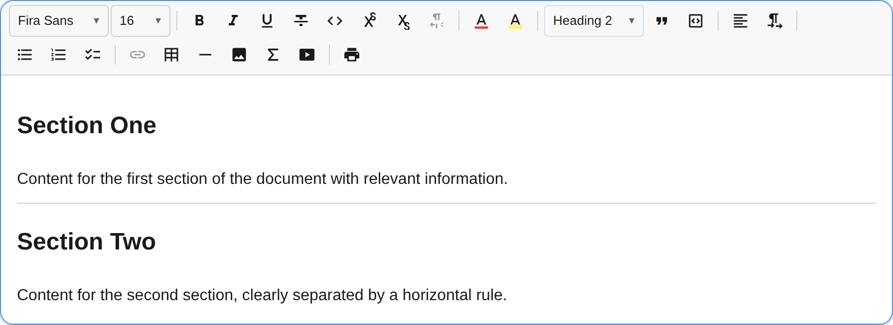

The `HorizontalRulePlugin` adds horizontal rule (divider) support with a toolbar button and Markdown-style input rule.



## Usage

```ts
import { HorizontalRulePlugin } from '@notectl/core/plugins/horizontal-rule';

new HorizontalRulePlugin()
```

## Configuration

```ts
interface HorizontalRuleConfig {
  /** Custom locale strings. */
  readonly locale?: HorizontalRuleLocale;
}
```

## Commands

| Command | Description | Returns |
|---------|-------------|---------|
| `insertHorizontalRule` | Insert a horizontal rule followed by a new paragraph | `boolean` |

```ts
editor.executeCommand('insertHorizontalRule');
```

The command inserts the `<hr>` and automatically creates a new paragraph below it, so the cursor has a place to continue typing.

## Keyboard Shortcuts

| Shortcut | Action |
|----------|--------|
| `Ctrl+Shift+H` / `Cmd+Shift+H` | Insert horizontal rule |

## Toolbar

The plugin registers a toolbar button in the `block` group with a horizontal line icon. Clicking it executes the `insertHorizontalRule` command.

## Input Rules

| Pattern | Result |
|---------|--------|
| `--- ` (three or more dashes + space) | Horizontal rule |

## Node Spec

| Type | HTML Tag | Description |
|------|----------|-------------|
| `horizontal_rule` | `<hr>` | Void block (no editable content) |

The horizontal rule is a **void block** — it has no text content and cannot be edited. It acts purely as a visual divider between content sections.
