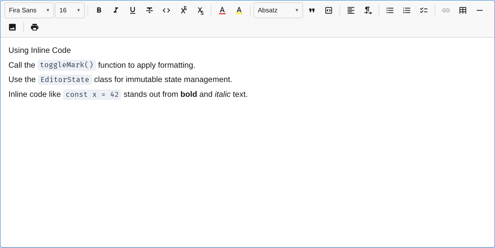

The `InlineCodePlugin` adds inline `<code>` formatting for marking up code snippets, variable names, or technical terms within running text.



## Usage

```ts
import { InlineCodePlugin } from '@notectl/core/plugins/inline-code';

new InlineCodePlugin()
```

## Configuration

```ts
interface InlineCodeConfig {
  /** Show toolbar button. Default: true */
  readonly toolbar?: boolean;
  /** Override keyboard shortcut. Set to null to disable. Default: 'Mod-E' */
  readonly keymap?: string | null;
  /** Enable backtick InputRule. Default: true */
  readonly inputRule?: boolean;
  /** Override locale strings. */
  readonly locale?: InlineCodeLocale;
}
```

### Examples

```ts
// Disable toolbar button (keyboard/input rule only)
new InlineCodePlugin({ toolbar: false })

// Custom keyboard shortcut
new InlineCodePlugin({ keymap: 'Mod-Shift-C' })

// Disable keyboard shortcut
new InlineCodePlugin({ keymap: null })

// Disable backtick input rule
new InlineCodePlugin({ inputRule: false })
```

## Commands

| Command | Description | Returns |
|---------|-------------|---------|
| `toggleInlineCode` | Toggle code mark on selection | `boolean` |

```ts
editor.executeCommand('toggleInlineCode');
```

## Keyboard Shortcuts

| Shortcut | Action |
|----------|--------|
| `Ctrl+E` / `Cmd+E` | Toggle inline code |

## Input Rules

| Pattern | Result |
|---------|--------|
| `` `text` `` | Wraps `text` with the code mark and removes the backticks |

The backtick rule is disabled inside code blocks to preserve literal backtick characters.

## Theming

### CSS Custom Properties

| Property | Default | Description |
|----------|---------|-------------|
| `--notectl-code-bg` | `var(--notectl-surface-raised)` | Background color |
| `--notectl-code-color` | `var(--notectl-fg)` | Text color |

Override via CSS on the editor element:

```css
notectl-editor {
  --notectl-code-bg: #f0f0f0;
  --notectl-code-color: #d63384;
}
```

Or responsive with media queries:

```css
@media (prefers-color-scheme: light) {
  notectl-editor {
    --notectl-code-bg: #edf0f5;
    --notectl-code-color: #334155;
  }
}

@media (prefers-color-scheme: dark) {
  notectl-editor {
    --notectl-code-bg: #313244;
    --notectl-code-color: #cdd6f4;
  }
}
```

### Theme Object

Use the `inlineCode` key in the theme object:

```ts
const editor = await createEditor({
  theme: {
    name: 'custom',
    primitives: { /* ... */ },
    inlineCode: {
      background: '#f0f0f0',
      foreground: '#d63384',
    },
  },
});
```

### High-Contrast Mode

In Windows High Contrast mode (`forced-colors: active`), inline code receives a visible `1px solid` border to remain distinguishable without relying on background color.

## Mark Spec

| Mark | HTML Tag | Rank |
|------|----------|------|
| `code` | `<code>` | 3 |

### HTML Parsing

The plugin recognizes two HTML patterns on paste:

| Pattern | Example |
|---------|---------|
| `<code>` element | `<code>text</code>` |
| `<span>` with monospace font | `<span style="font-family: monospace">text</span>` |

The monospace span rule covers paste content from Google Docs and similar editors that use inline styles instead of semantic `<code>` tags.

## Mark Exclusivity

Inline code is mutually exclusive with formatting marks. When code is applied, existing formatting marks are automatically stripped. When the cursor is inside code-marked text, formatting commands are blocked.

| Excluded marks | Allowed marks |
|----------------|---------------|
| bold, italic, underline, strikethrough, highlight, font, fontSize, superscript, subscript | link |

This matches the convention used by editors like VS Code, GitHub, and Notion, where inline code is rendered in a monospace font without additional styling.

## Toolbar

The inline code button (`</>` icon) renders in the **format** toolbar group with an `isActive` check. When the cursor is inside code-marked text, the button appears highlighted.

## Internationalization

8 locales are bundled: English (default), German, Spanish, French, Chinese, Russian, Arabic, Hindi, and Portuguese. Locales are lazy-loaded based on the editor's language setting.

```ts
import type { InlineCodeLocale } from '@notectl/core/plugins/inline-code';

const customLocale: InlineCodeLocale = {
  label: 'Code',
  tooltip: (shortcut) => `Code (${shortcut})`,
};

new InlineCodePlugin({ locale: customLocale })
```
