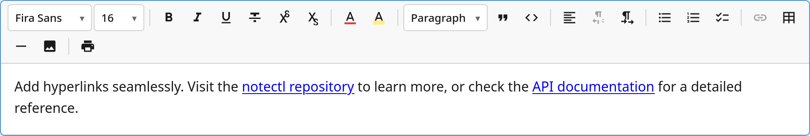

The `LinkPlugin` adds hyperlink support with a toolbar button that opens a URL input popup.



## Usage

```ts
import { LinkPlugin } from '@notectl/core';

new LinkPlugin()
// or:
new LinkPlugin({ openInNewTab: true })
```

## Configuration

```ts
interface LinkConfig {
  /** Whether links open in a new tab (adds target="_blank"). Default: true */
  readonly openInNewTab: boolean;
  /** Render separator after toolbar item. */
  readonly separatorAfter?: boolean;
}
```

## Commands

| Command | Description | Returns |
|---------|-------------|---------|
| `toggleLink` | Add or remove a link on the selection | `boolean` |
| `removeLink` | Remove link mark from selection | `boolean` |

```ts
editor.executeCommand('toggleLink');
editor.executeCommand('removeLink');
```

## Keyboard Shortcuts

| Shortcut | Action |
|----------|--------|
| `Ctrl+K` / `Cmd+K` | Toggle link (opens URL popup if adding) |

## Toolbar

The link button opens a **custom popup** with:
- A URL input field with placeholder text
- Apply/Cancel buttons
- When the cursor is inside an existing link: pre-filled URL and a "Remove" button

## Mark Spec

| Mark | HTML Tag | Attributes | Renders As |
|------|----------|-----------|-----------|
| `link` | `<a>` | `href: string` | `<a href="...">` with optional `target="_blank"` |

When `openInNewTab` is `true`, the `toDOM` method adds `target="_blank"` and `rel="noopener noreferrer"` to the rendered `<a>` element.

## Programmatic Link Insertion

To add a link programmatically without the popup:

```ts
// Select text first, then apply the link mark
const state = editor.getState();
const tr = state.transaction('api')
  .addMark(
    state.selection.anchor,
    state.selection.head,
    { type: 'link', attrs: { href: 'https://example.com' } }
  )
  .build();
editor.dispatch(tr);
```
