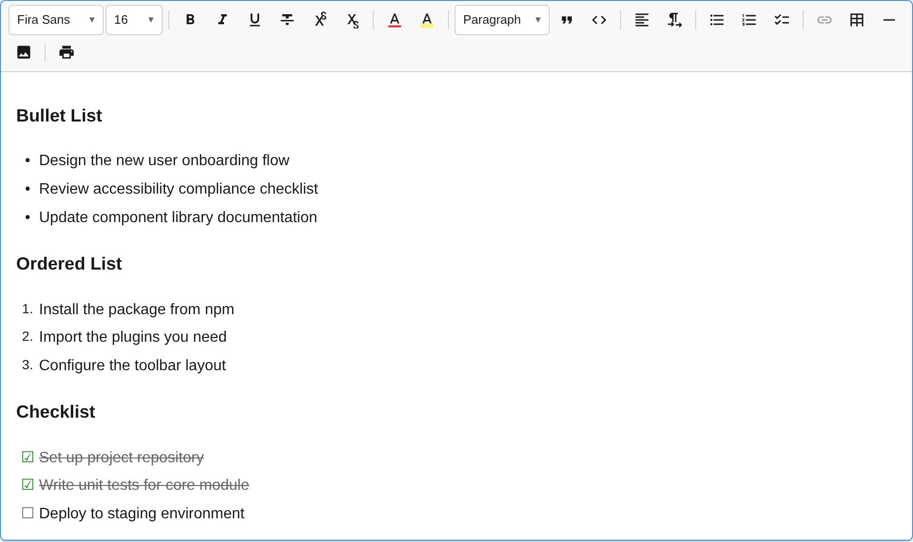

The `ListPlugin` provides bullet lists, ordered (numbered) lists, and checklists with indent/outdent support up to configurable nesting depth.



## Usage

```ts
import { ListPlugin } from '@notectl/core';

new ListPlugin()
// or with custom config:
new ListPlugin({ types: ['bullet', 'ordered'], maxIndent: 3 })
```

## Configuration

```ts
interface ListConfig {
  /** Which list types to enable. Default: ['bullet', 'ordered', 'checklist'] */
  readonly types: ListType[];
  /** Maximum nesting level. Default: 4 */
  readonly maxIndent: number;
  /** Render separator after toolbar item. */
  readonly separatorAfter?: boolean;
}

type ListType = 'bullet' | 'ordered' | 'checklist';
```

### Example: Only bullet and ordered lists

```ts
new ListPlugin({ types: ['bullet', 'ordered'] })
```

### Example: Deep nesting

```ts
new ListPlugin({ maxIndent: 8 })
```

## Commands

| Command | Description | Returns |
|---------|-------------|---------|
| `toggleList:bullet` | Toggle bullet list on current block | `boolean` |
| `toggleList:ordered` | Toggle ordered list on current block | `boolean` |
| `toggleList:checklist` | Toggle checklist on current block | `boolean` |
| `indentListItem` | Increase indent level (up to `maxIndent`) | `boolean` |
| `outdentListItem` | Decrease indent level | `boolean` |
| `toggleChecklistItem` | Toggle checked state on checklist item | `boolean` |

```ts
// Create a bullet list
editor.executeCommand('toggleList:bullet');

// Indent a list item
editor.executeCommand('indentListItem');

// Toggle a checkbox
editor.executeCommand('toggleChecklistItem');
```

## Keyboard Shortcuts

| Shortcut | Action |
|----------|--------|
| `Enter` | Split list item; exit list if the item is empty |
| `Backspace` | Convert to paragraph when cursor is at start of item |
| `Tab` | Indent list item (increase nesting) |
| `Shift+Tab` | Outdent list item (decrease nesting) |

## Input Rules

Type at the beginning of a line:

| Pattern | Result |
|---------|--------|
| `- ` or `* ` | Bullet list |
| `1. ` (any number followed by `.`) | Ordered list |
| `[ ] ` | Unchecked checklist item |
| `[x] ` | Checked checklist item |

## Toolbar

Three toolbar buttons, one for each list type. Each button toggles its respective list type. The active state highlights when the cursor is inside a matching list item.

| Button | Icon | List Type |
|--------|------|-----------|
| Bullet list | Bullet icon | `bullet` |
| Ordered list | Number icon | `ordered` |
| Checklist | Checkbox icon | `checklist` |

## Node Spec

| Type | Attributes | Description |
|------|-----------|-------------|
| `list_item` | `listType`, `indent`, `checked` | Single list node type for all list variants |

```ts
// Attribute types
interface ListItemAttributes {
  listType: 'bullet' | 'ordered' | 'checklist';
  indent: number;    // 0-based, max is maxIndent
  checked: boolean;  // Only meaningful for checklist items
}
```

notectl uses a flat list model: each `list_item` carries its own `listType` and `indent` level. This avoids the complexity of nested `<ul>/<ol>` structures and simplifies indent/outdent operations.
