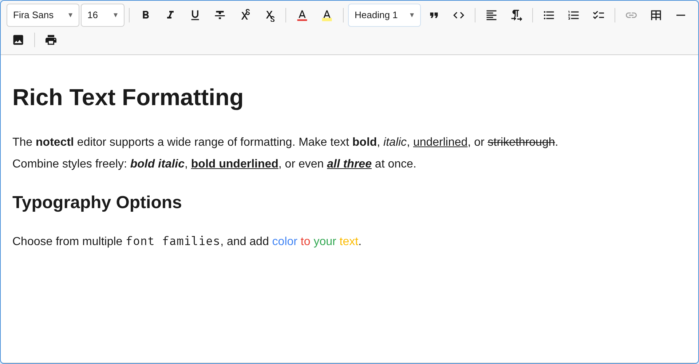

import { LinkCard, CardGrid } from '@astrojs/starlight/components';

notectl ships with **21 built-in plugins**. Every editor feature — from bold text to tables — is implemented as a plugin. You can use all of them, a subset, or build your own.



## Plugin List

| Plugin | ID | Description | Keyboard Shortcuts |
|--------|----|-------------|-------------------|
| [TextFormattingPlugin](/notectl/plugins/text-formatting/) | `text-formatting` | Bold, italic, underline | `Ctrl+B`, `Ctrl+I`, `Ctrl+U` |
| [HeadingPlugin](/notectl/plugins/heading/) | `heading` | Heading levels 1-6, Title, Subtitle | `Ctrl+Shift+1`-`6` |
| [ListPlugin](/notectl/plugins/list/) | `list` | Bullet, ordered, and checklist | `Tab`, `Shift+Tab` |
| [LinkPlugin](/notectl/plugins/link/) | `link` | Hyperlinks | `Ctrl+K` |
| [TablePlugin](/notectl/plugins/table/) | `table` | Tables with cell selection | `Tab`, `Enter` |
| [CodeBlockPlugin](/notectl/plugins/code-block/) | `code-block` | Fenced code blocks with syntax highlighting | `` ``` `` (input rule) |
| [BlockquotePlugin](/notectl/plugins/blockquote/) | `blockquote` | Block quotes | `Ctrl+Shift+>` |
| [ImagePlugin](/notectl/plugins/image/) | `image` | Image blocks with upload support | - |
| [FontPlugin](/notectl/plugins/font/) | `font` | Custom font families | - |
| [FontSizePlugin](/notectl/plugins/font-size/) | `fontSize` | Font size control | `Ctrl+Shift++`/`-` |
| [TextColorPlugin](/notectl/plugins/text-color/) | `textColor` | Text color picker | - |
| [AlignmentPlugin](/notectl/plugins/alignment/) | `alignment` | Left, center, right, justify | `Ctrl+Shift+L`/`E`/`R`/`J` |
| [StrikethroughPlugin](/notectl/plugins/strikethrough/) | `strikethrough` | Strikethrough text | `Ctrl+Shift+X` |
| [SuperSubPlugin](/notectl/plugins/super-sub/) | `super-sub` | Superscript & subscript | `Ctrl+.`, `Ctrl+,` |
| [HighlightPlugin](/notectl/plugins/highlight/) | `highlight` | Text highlight (background color) | - |
| [HorizontalRulePlugin](/notectl/plugins/horizontal-rule/) | `horizontal-rule` | Horizontal divider lines | - |
| [HardBreakPlugin](/notectl/plugins/hard-break/) | `hard-break` | Line breaks within a block | `Shift+Enter` |
| [PrintPlugin](/notectl/plugins/print/) | `print` | Print with clean output and HTML export | `Ctrl+P` |
| [ToolbarPlugin](/notectl/plugins/toolbar/) | `toolbar` | Toolbar UI (auto-created) | - |
| [CaretNavigationPlugin](/notectl/plugins/caret-navigation/) | `caret-navigation` | Platform-aware keyboard navigation keymaps | Arrow keys, word/line/document movement |
| [GapCursorPlugin](/notectl/plugins/gap-cursor/) | `gap-cursor` | Virtual cursor at void-block boundaries | Arrow keys (when gap cursor active) |

## How Plugins Work

Each plugin implements the `Plugin` interface and registers its capabilities during `init()`:

```ts
interface Plugin {
  /** Unique identifier. */
  readonly id: string;
  /** Human-readable name. */
  readonly name: string;
  /** Plugin initialization order (lower = first). */
  readonly priority?: number;
  /** Required plugin IDs that must be loaded first. */
  readonly dependencies?: readonly string[];

  /** Register schema, commands, keymaps, toolbar items. */
  init(context: PluginContext): void | Promise<void>;
  /** Clean up when the editor is destroyed. */
  destroy?(): void | Promise<void>;
  /** Called on every state change (for reactive updates). */
  onStateChange?(oldState: EditorState, newState: EditorState, tr: Transaction): void;
  /** Called when configurePlugin() is used at runtime. */
  onConfigure?(config: TConfig): void;
  /** Called once after all plugins are initialized. */
  onReady?(): void | Promise<void>;
  /** Called when the editor's read-only mode changes. */
  onReadOnlyChange?(readonly: boolean): void;
  /** Returns decorations for the current state. */
  decorations?(state: EditorState, tr?: Transaction): DecorationSet;
}
```

## What Plugins Can Register

Plugins register through the `PluginContext`:

| Method | What it does | Example |
|--------|-------------|---------|
| `registerNodeSpec()` | New block types | heading, list_item, table, blockquote |
| `registerMarkSpec()` | New inline marks | bold, italic, link, textColor |
| `registerInlineNodeSpec()` | New inline elements | hard_break, emoji, mention |
| `registerCommand()` | Named commands | toggleBold, insertTable, alignCenter |
| `registerKeymap()` | Keyboard shortcuts | `Mod-B` for bold, `Mod-K` for link |
| `registerInputRule()` | Text pattern transforms | `# ` to heading, `---` to horizontal rule |
| `registerToolbarItem()` | Toolbar buttons/dropdowns | Bold button, heading dropdown, color picker |
| `registerBlockTypePickerEntry()` | Block type dropdown entries | Heading levels, paragraph, title |
| `registerNodeView()` | Custom block renderers | Code block header, image upload UI, table controls |
| `registerMiddleware()` | Transaction interceptors | Preserve alignment on block type change |
| `registerService()` | Typed services | ToolbarService, TableSelectionService |
| `registerFileHandler()` | File paste/drop handlers | Image upload on drag-and-drop |
| `registerStyleSheet()` | Inject plugin CSS | Table grid styles, code block theme |
| `announce()` | Screen reader announcements | "Image resized", "Entered code block" |
| `executeCommand()` | Execute a registered command | Trigger toggleBold from keyboard handler |
| `getEventBus()` | Access typed event bus | Emit/subscribe to plugin events |
| `isReadOnly()` | Check read-only state | Skip mutations in read-only mode |
| `updateConfig()` | Push runtime config updates | Dynamic plugin reconfiguration |

## Plugin Composition

Use plugins with the `toolbar` config for a visual toolbar:

```ts
const editor = await createEditor({
  toolbar: [
    [new TextFormattingPlugin()],           // Group 1: B I U
    [new HeadingPlugin()],                  // Group 2: Heading dropdown
    [new ListPlugin(), new BlockquotePlugin()], // Group 3: Lists + blockquote
    [new LinkPlugin(), new TablePlugin()],  // Group 4: Link + table
    [new CodeBlockPlugin()],               // Group 5: Code blocks
  ],
});
```

Or use `plugins` for headless mode (no toolbar):

```ts
const editor = await createEditor({
  plugins: [
    new TextFormattingPlugin(),
    new HeadingPlugin(),
  ],
});
```

## Auto-Registration

`TextFormattingPlugin` is auto-registered with default settings if not explicitly provided. All other plugins must be added manually.

## Learn More

<CardGrid>
  <LinkCard title="Write Your Own Plugin" href="/notectl/guides/writing-plugins/" description="Full guide to building custom plugins." />
  <LinkCard title="Plugin Interface API" href="/notectl/api/plugin-interface/" description="Complete PluginContext API reference." />
</CardGrid>
