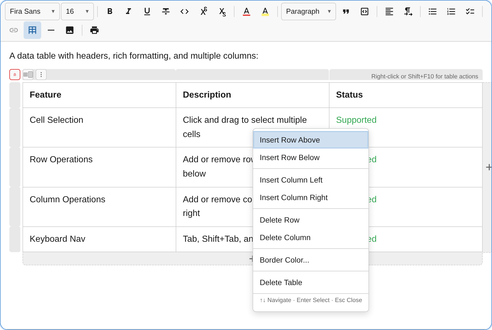
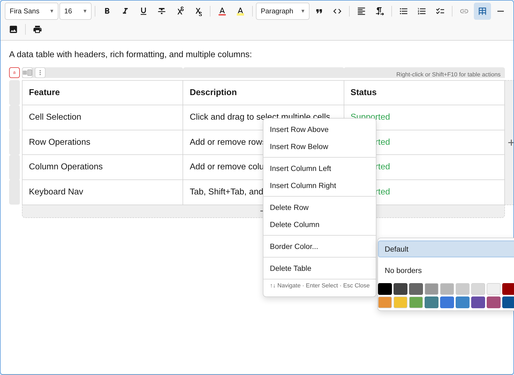

The `TablePlugin` provides comprehensive table support including a grid picker for insertion, a fully accessible context menu, border color customization, multi-cell selection, interactive visual controls, and complete keyboard navigation.


## Usage

```ts
import { TablePlugin } from '@notectl/core';

new TablePlugin()
// or with custom picker size:
new TablePlugin({ maxPickerRows: 10, maxPickerCols: 10 })
```

## Configuration

```ts
interface TableConfig {
  /** Maximum rows in grid picker. Default: 8 */
  readonly maxPickerRows?: number;
  /** Maximum columns in grid picker. Default: 8 */
  readonly maxPickerCols?: number;
  /** Render separator after toolbar item. */
  readonly separatorAfter?: boolean;
  /** Locale for all user-facing strings. Defaults to auto-detected language. */
  readonly locale?: TableLocale;
}
```

### Locale Override

Each plugin resolves its locale automatically from the editor's global `locale` setting. To override the table locale independently:

```ts
import { TablePlugin, TABLE_LOCALE_DE } from '@notectl/core';

new TablePlugin({ locale: TABLE_LOCALE_DE })
```

See the [Internationalization guide](/notectl/guides/internationalization/) for details on global and per-plugin locale configuration.

## Commands

| Command | Description | Returns |
|---------|-------------|---------|
| `insertTable` | Insert a table (via grid picker selection) | `boolean` |
| `addRowAbove` | Insert row above current cell | `boolean` |
| `addRowBelow` | Insert row below current cell | `boolean` |
| `addColumnLeft` | Insert column to the left of current cell | `boolean` |
| `addColumnRight` | Insert column to the right of current cell | `boolean` |
| `deleteRow` | Delete the row containing the cursor | `boolean` |
| `deleteColumn` | Delete the column containing the cursor | `boolean` |
| `deleteTable` | Delete the entire table | `boolean` |
| `selectTable` | Select the entire table | `boolean` |
| `resetTableBorderColor` | Reset border color to theme default | `boolean` |

```ts
// Insert a table programmatically
editor.executeCommand('insertTable');

// Modify table structure
editor.executeCommand('addRowBelow');
editor.executeCommand('deleteColumn');

// Reset border color
editor.executeCommand('resetTableBorderColor');
```

## Context Menu

Right-click inside any table cell (or press `Shift+F10`) to open an accessible context menu with all table operations.



The context menu provides:

- **Insert Row Above / Below** — add rows relative to the cursor
- **Insert Column Left / Right** — add columns relative to the cursor
- **Delete Row / Column** — remove the current row or column
- **Border Color** — opens a color picker submenu
- **Delete Table** — remove the entire table

### Keyboard Navigation

The context menu is fully keyboard-accessible following WAI-ARIA menu patterns:

| Key | Action |
|-----|--------|
| `ArrowDown` / `ArrowUp` | Move focus between menu items |
| `Enter` / `Space` | Activate the focused item |
| `ArrowRight` | Open submenu (on Border Color item) |
| `ArrowLeft` | Close submenu, return to parent |
| `Home` / `End` | Jump to first / last menu item |
| `Escape` | Close the menu |

## Border Colors

Customize table border colors through the context menu or the border color button in the table controls overlay.



The border color picker provides:

- **Default** — reset to the theme's default border color
- **No borders** — remove all visible borders
- **Color grid** — 20 subdued, border-appropriate colors (grays, earth tones, muted hues)

The color grid supports full keyboard navigation with arrow keys, Home/End, Enter to select, and Escape to close.

### Programmatic Border Color

```ts
import { TableSelectionServiceKey } from '@notectl/core';

// Reset to default
editor.executeCommand('resetTableBorderColor');
```

## Interactive Controls

When hovering over a table, interactive overlay controls appear:

- **Column handles** — appear above each column. Click to select; each handle has a delete button
- **Row handles** — appear to the left of each row. Click to select; each handle has a delete button
- **Add row zone** — a button below the table to append a new row
- **Add column zone** — a button to the right of the table to append a new column
- **Insert lines** — hover between rows or columns to see a blue insert line with a `+` button. Click to insert a row or column at that position
- **Actions button** — opens the context menu
- **Border color button** — quick access to the border color picker
- **Delete table button** — remove the entire table

## Keyboard Shortcuts

| Shortcut | Action |
|----------|--------|
| `Tab` | Move to next cell (wraps to next row, adds row at end) |
| `Shift+Tab` | Move to previous cell |
| `Enter` | Move to cell below |
| `Shift+F10` | Open context menu |
| `Backspace` | Delete content or merge with previous cell |
| `Delete` | Delete content or merge with next cell |
| `Escape` | Exit table selection |
| Arrow keys | Navigate between cells |

## Toolbar

The table toolbar button shows a **grid picker popup**. Hover over cells to select the table dimensions (e.g., 3x4), then click to insert. The label updates dynamically to show the current hover dimensions.

## Node Specs

| Type | HTML Tag | Attributes | Description |
|------|----------|-----------|-------------|
| `table` | `<table>` | `borderColor?: string` | Table container |
| `table_row` | `<tr>` | - | Table row |
| `table_cell` | `<td>` | `colspan?: number`, `rowspan?: number` | Table cell |

## Multi-Cell Selection

The table plugin supports selecting multiple cells by click-and-drag. Selected cells are highlighted and can be operated on as a group (e.g., delete all selected cells' content).

### TableSelectionService

Access the selection service programmatically:

```ts
import { TableSelectionServiceKey } from '@notectl/core';

const service = editor.getService(TableSelectionServiceKey);
```

## Accessibility

The table plugin follows WAI-ARIA best practices:

- Tables are announced with dimensions (e.g., "Table with 3 rows and 4 columns")
- A description hint tells screen readers how to access table actions
- All row/column operations announce their result (e.g., "Row inserted above")
- Border color changes are announced (e.g., "Table border color set to Blue")
- The context menu uses `role="menu"` with `role="menuitem"` for each action
- The border color grid uses `role="grid"` with `role="gridcell"` for each swatch
- All interactive elements follow roving tabindex patterns

## Custom Node Views

Tables use custom `NodeView` implementations for:
- **Table wrapper** with horizontal scroll support for wide tables
- **Row rendering** with proper `<tr>` element management
- **Cell rendering** with editable content areas inside `<td>` elements
