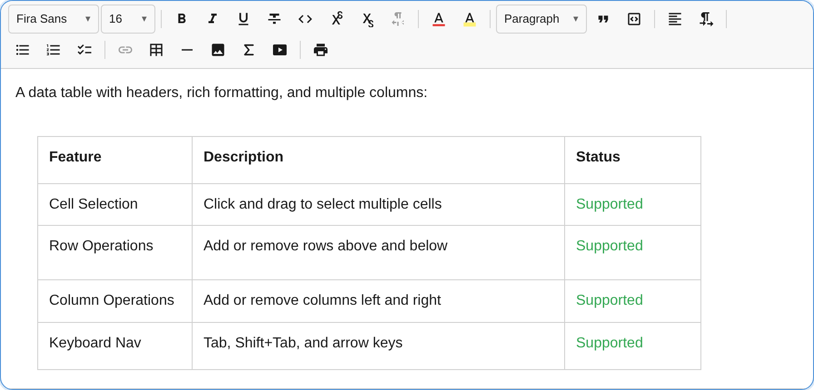
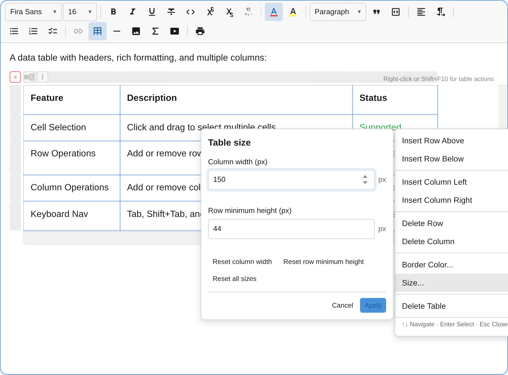
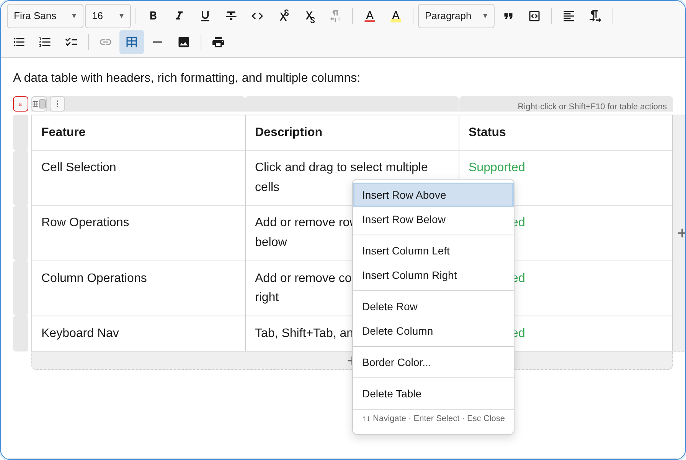
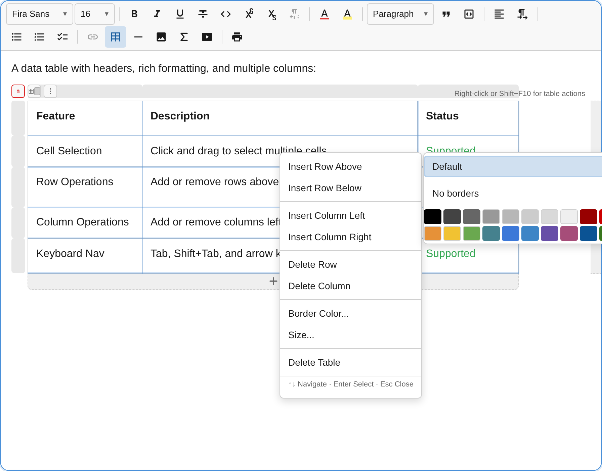

The `TablePlugin` provides a grid picker, row and column operations, multi-cell selection,
border colors, and persistent table sizing. Column widths and row minimum heights are document
state: they survive undo/redo, JSON, HTML, supported clipboard slices, Markdown's HTML fallback,
and static or print output.



## Usage

```ts
import { TablePlugin } from '@notectl/core/plugins/table';

new TablePlugin();

// Or customize the picker and sizing behavior.
new TablePlugin({
  maxPickerRows: 10,
  maxPickerCols: 10,
  minColumnWidthPx: 72,
  minRowHeightPx: 28,
  keyboardResizeStepPx: 5,
  keyboardResizeLargeStepPx: 25,
});
```

All dimensions use CSS pixels. A cell does not own an independent width or height:

- its width comes from every logical column it covers;
- its height comes from every logical row it covers;
- a configured row height is a **minimum**, so text, browser zoom, font changes, images, and
  embedded blocks can make the row taller without clipping its content.

Automatic columns share the remaining table width. With any automatic column, a table stays at
least as wide as its content area. When every column is explicit, its rendered width is the exact
sum of those values. If configured column minimums no longer fit, the table wrapper scrolls
horizontally instead of collapsing columns below their minimum.

## Configuration

```ts
interface TableConfig {
  readonly maxPickerRows?: number;
  readonly maxPickerCols?: number;
  readonly locale?: TableLocale;

  readonly minColumnWidthPx?: number;
  readonly minRowHeightPx?: number;
  readonly maxColumnWidthPx?: number;
  readonly maxRowHeightPx?: number;
  readonly keyboardResizeStepPx?: number;
  readonly keyboardResizeLargeStepPx?: number;
  readonly directResize?: boolean;
}
```

| Option | Default | Description |
|---|---:|---|
| `maxPickerRows` | `8` | Maximum rows in the insertion grid. |
| `maxPickerCols` | `8` | Maximum columns in the insertion grid. |
| `locale` | editor locale | Override all table labels and announcements. |
| `minColumnWidthPx` | `60` | Minimum width accepted by pointer, keyboard, dialog, and API sizing. |
| `minRowHeightPx` | `24` | Minimum row height accepted by every sizing path. |
| `maxColumnWidthPx` | `10000` | Maximum accepted column width. |
| `maxRowHeightPx` | `10000` | Maximum accepted row minimum height. |
| `keyboardResizeStepPx` | `8` | Normal separator-key resize step. |
| `keyboardResizeLargeStepPx` | `32` | Resize step while `Shift` is held. |
| `directResize` | `true` | Show pointer/touch and keyboard separator controls. The size dialog and public API remain available when `false`. |

Pointer, keyboard, public-API, and precise-dialog values are clamped to the configured bounds.
Invalid values, such as `NaN`, are
rejected without a partial update. Configuration itself is normalized to the globally safe range
of `1` to `10000` px; an upper bound below its lower bound resolves to the lower bound.

### Locale override

Each plugin resolves its locale automatically from the editor's global `locale` setting. To
override the table locale independently:

```ts
import { TablePlugin, loadTableLocale } from '@notectl/core/plugins/table';

const tableDe = await loadTableLocale('de');
new TablePlugin({ locale: tableDe });
```

See the [Internationalization guide](/notectl/guides/internationalization/) for global and
per-plugin locale configuration.

## Resize with a mouse or touch

When table controls are active, resize separators appear between logical columns and rows.

1. Drag a column separator horizontally or a row separator vertically with a mouse or touch.
2. A live indicator shows the proposed pixel dimension while the pointer moves.
3. Release to commit one transaction and one undo history entry.
4. Press `Escape` during the drag to cancel and restore the original dimensions.

The preview is temporary DOM state; the completed transaction is the source of truth. Controls
measure the rendered `<col>` and `<tr>` geometry, so they stay aligned after custom sizes, content
growth, zoom, editor resizing, or horizontal scrolling.

Direct resizing uses logical ownership. In RTL, separators and drag direction are mirrored
visually, but the same separator still updates the same logical column and sizes never become
negative.

## Keyboard resizing

Resize separators are focusable, localized `separator` controls with their orientation, current
value, and minimum exposed to assistive technology.

| Focused control | Key | Action |
|---|---|---|
| Column separator | `ArrowLeft` / `ArrowRight` | Decrease or increase the logical column width by `keyboardResizeStepPx`. Horizontal direction follows the rendered LTR/RTL direction. |
| Row separator | `ArrowUp` / `ArrowDown` | Decrease or increase the row minimum height by `keyboardResizeStepPx`. |
| Either separator | `Shift` + resize arrow | Use `keyboardResizeLargeStepPx` instead. |
| Either separator | `Delete` / `Backspace` | Reset that logical column or row to automatic layout. |

Each accepted key press uses the same validation and transaction path as pointer and API sizing.
Completed sizes and automatic resets are announced through the active `TableLocale`.

## Precise size dialog

Choose **Size…** from the table actions/context menu for exact values. The dialog exposes
**Column width (px)** and **Row minimum height (px)** and works with:



- the cell containing the caret;
- a selected row or column handle;
- a rectangular multi-cell selection.

For a rectangular selection, width applies to every covered logical column and minimum height to
every covered logical row. Different current values are shown as **Mixed**. A spanning cell applies
to every logical row and column covered by its `rowspan` and `colspan`.

Each field can be reset independently to **Automatic**, or **Reset all sizes** can reset every
available axis together. Reset buttons commit immediately; applying two entered values commits
them atomically. Finite out-of-range input is clamped; empty or non-numeric input stays in the
dialog with a localized validation error.
Closing or cancelling the dialog returns focus to its invoking control or cell.

## Public sizing API

`TableSizingService` is the strongly typed programmatic boundary. It supports the current table
selection for common operations and explicit zero-based logical coordinates for integrations.

```ts
import { TableSizingServiceKey } from '@notectl/core/plugins/table';

const sizing = editor.getService(TableSizingServiceKey);
if (!sizing) throw new Error('TablePlugin is not registered');

// Caret cell or rectangular table selection: update both axes atomically.
sizing.setSelectionSize({
  columnWidthPx: 180,
  rowMinHeightPx: 48,
});

// Reset only the selected columns; keep selected row minimum heights.
sizing.resetSelectionSize('columnWidthPx');

// Reset every available selected axis to automatic layout.
sizing.resetSelectionSize();
```

`'auto'` can also be passed directly to a setter:

```ts
sizing.setSelectionSize({ columnWidthPx: 'auto' });
```

### Explicit logical targets

The following example finds a table ID from the public document model, then targets logical
coordinates. Range endpoints are inclusive.

```ts
const table = editor.getJSON().children.find((node) => node.type === 'table');
if (!table) throw new Error('No table found');

// Logical column 2 (the third column).
sizing.setSize(
  { kind: 'column', tableId: table.id, column: 2 },
  { columnWidthPx: 240 },
);

// Logical row 1 (the second row).
sizing.setSize(
  { kind: 'row', tableId: table.id, row: 1 },
  { rowMinHeightPx: 56 },
);

// The cell occupying logical grid position (1, 2). A spanning cell expands
// this target to all logical rows and columns that the cell covers.
sizing.setSize(
  { kind: 'cell', tableId: table.id, row: 1, column: 2 },
  { columnWidthPx: 200, rowMinHeightPx: 44 },
);

// Inclusive rectangular logical range: rows 1..3 and columns 0..2.
sizing.setSize(
  {
    kind: 'range',
    tableId: table.id,
    fromRow: 1,
    fromColumn: 0,
    toRow: 3,
    toColumn: 2,
  },
  { columnWidthPx: 160, rowMinHeightPx: 40 },
);

sizing.resetSize(
  { kind: 'column', tableId: table.id, column: 2 },
  'columnWidthPx',
);
```

### Types and return values

```ts
import type { BlockId } from '@notectl/core';

type TableDimensionInput = number | 'auto';
type TableDimensionState = number | 'auto' | 'mixed' | 'unavailable';
type TableSizeDimension = 'columnWidthPx' | 'rowMinHeightPx';

interface TableSizeInput {
  readonly columnWidthPx?: TableDimensionInput;
  readonly rowMinHeightPx?: TableDimensionInput;
}

interface TableSizeState {
  readonly columnWidthPx: TableDimensionState;
  readonly rowMinHeightPx: TableDimensionState;
}

type TableSizeTarget =
  | { readonly kind: 'cell'; readonly tableId: BlockId; readonly row: number; readonly column: number }
  | {
      readonly kind: 'range';
      readonly tableId: BlockId;
      readonly fromRow: number;
      readonly fromColumn: number;
      readonly toRow: number;
      readonly toColumn: number;
    }
  | { readonly kind: 'column'; readonly tableId: BlockId; readonly column: number }
  | { readonly kind: 'row'; readonly tableId: BlockId; readonly row: number };

interface TableSizingService {
  getSelectionSize(): TableSizeState | null;
  setSelectionSize(input: TableSizeInput): boolean;
  resetSelectionSize(dimension?: TableSizeDimension): boolean;

  getSize(target: TableSizeTarget): TableSizeState | null;
  setSize(target: TableSizeTarget, input: TableSizeInput): boolean;
  resetSize(target: TableSizeTarget, dimension?: TableSizeDimension): boolean;
}
```

The read methods return `null` when no valid table target exists. A state is a pixel number,
`'auto'`, `'mixed'` for different values across an axis, or `'unavailable'` when that target has no
such axis (for example row minimum height on a column-only target).

Mutation methods return `true` only when they dispatch a change. They return `false` for an invalid
or out-of-bounds target, an incompatible input/target combination, an invalid value, an empty
input, a no-op, or read-only mode. A multi-axis call never applies only the valid half.

The table entry point exports `TableSizingServiceKey`, `TableSizingService`, `TableSizeTarget`,
`TableCellSizeTarget`, `TableRangeSizeTarget`, `TableColumnSizeTarget`, `TableRowSizeTarget`, and
the input/state/dimension types shown above.

## Persistence and interchange

### JSON document state

There is one canonical value per logical axis:

```json
{
  "type": "table",
  "attrs": {
    "columnWidthsPx": [160, null, 240]
  },
  "children": [
    {
      "type": "table_row",
      "attrs": { "minHeightPx": 48 },
      "children": []
    }
  ]
}
```

`null` is an automatic column slot. An all-automatic column vector is omitted, as is
`table_row.attrs.minHeightPx` for an automatic row. `getJSON()`/`setJSON()` and undo/redo preserve
the immutable metadata. Inserting a row or column creates an automatic dimension; deleting one
removes its matching metadata entry. Undo restores structure and dimensions together.

### HTML, clipboard, and print

HTML export uses semantic column- and row-level metadata instead of repeating dimensions on every
cell:

```html
<table style="border-collapse: collapse; width: 100%; table-layout: fixed; min-width: 460px">
  <colgroup>
    <col data-notectl-width-px="160" style="width: 160px">
    <col>
    <col data-notectl-width-px="240" style="width: 240px">
  </colgroup>
  <tbody>
    <tr data-notectl-min-height-px="48" style="height: 48px">...</tr>
  </tbody>
</table>
```

The `data-notectl-*-px` attributes carry the canonical numeric values. In
`cssMode: 'classes'`, generated size declarations go through the same CSP style collector as other
editor styles, so exported HTML has no inline `style` attributes and the returned stylesheet
reproduces the dimensions.

Import prefers the canonical metadata and also accepts unambiguous conventional `<col>` widths and
`<tr>` heights expressed as bounded numeric values or exact `px` lengths. Percentages, other CSS
units, expressions such as `calc(...)`, malformed values, excessive values, and arbitrary CSS are
rejected rather than entering document state.

Whole tables and table slices with an unambiguous logical-axis mapping preserve their relevant
dimensions through copy, cut, and paste. A fragment that cannot retain an unambiguous mapping uses
automatic layout for the affected axis. Static HTML and print output use the same persisted
dimensions; wide tables keep their overflow behavior instead of shrinking below their minimums.

### Markdown

GFM pipe tables cannot represent `colspan`, `rowspan`, column width, or row minimum height. The
default Markdown export therefore uses the existing raw-HTML fallback whenever a table has spans
or an explicit dimension:

```ts
const lossless = await editor.getContentMarkdown();
// htmlFallback: true (default): semantic <table>/<colgroup>/<col>/<tr> HTML
```

That raw HTML imports back into the canonical model when `htmlFallback` is enabled on import. For
portable Markdown with raw HTML disabled:

```ts
const portable = await editor.getContentMarkdown({ htmlFallback: false });
```

The result is a plain GFM pipe table: cell text is retained, while spans and all table dimensions
are deliberately dropped and become automatic when re-imported. This is the explicit lossy mode;
the default does not silently discard sizing.

## Logical grid, spans, and structure

All sizing coordinates use the table's logical grid, not a row's child-array index. This keeps
selection, sizing, insertion, deletion, rendering, import, and export consistent when cells carry
`colspan` or `rowspan`.

- A column width belongs to one logical column on the `table` node.
- A row minimum height belongs to one logical `table_row`.
- A spanning cell's size control affects every logical axis it covers.
- Inserting and deleting logical rows or columns updates dimension metadata in the same
  transaction.

## Commands

| Command | Description | Returns |
|---|---|---|
| `insertTable` | Insert a table via the grid picker selection. | `boolean` |
| `addRowAbove` | Insert a row above the current cell. | `boolean` |
| `addRowBelow` | Insert a row below the current cell. | `boolean` |
| `addColumnLeft` | Insert a column to the logical left of the current cell. | `boolean` |
| `addColumnRight` | Insert a column to the logical right of the current cell. | `boolean` |
| `deleteRow` | Delete the row containing the cursor. | `boolean` |
| `deleteColumn` | Delete the column containing the cursor. | `boolean` |
| `deleteTable` | Delete the entire table. | `boolean` |
| `selectTable` | Select the entire table. | `boolean` |
| `resetTableBorderColor` | Reset border color to the theme default. | `boolean` |

```ts
editor.executeCommand('insertTable');
editor.executeCommand('addRowBelow');
editor.executeCommand('deleteColumn');
editor.executeCommand('resetTableBorderColor');
```

Sizing intentionally uses the typed service above rather than multiple overlapping string
commands.

## Context menu and interactive controls

Right-click inside a table cell, press `Shift+F10`, or use the table actions button to open the
accessible context menu.



The menu provides row/column insertion and deletion, **Size…**, border color, and table deletion.
It follows the WAI-ARIA menu pattern:

| Key | Action |
|---|---|
| `ArrowDown` / `ArrowUp` | Move focus between menu items. |
| `Enter` / `Space` | Activate the focused item. |
| `ArrowRight` / `ArrowLeft` | Open or close a submenu, mirrored in RTL. |
| `Home` / `End` | Jump to the first or last item. |
| `Escape` | Close the menu. |

The overlay also provides row and column handles, edge add buttons, insertion lines, the actions
button, border color, and table deletion. Control geometry follows custom dimensions and wrapper
scrolling.

## Border colors

Customize borders through the context menu or border color button.



- **Default** resets to the theme's border color.
- **No borders** makes borders transparent.
- The color grid contains 20 subdued border colors.

The grid supports arrow keys, `Home`/`End`, `Enter`, and `Escape`.

## Keyboard shortcuts

| Shortcut | Action |
|---|---|
| `Tab` | Move to the next cell; add a row at the end. |
| `Shift+Tab` | Move to the previous cell. |
| `Shift+F10` | Open the table context menu. |
| `Backspace` / `Delete` | Delete content or merge at a cell boundary. |
| `Escape` | Exit table selection, or cancel an active pointer/touch resize. |
| Arrow keys | Navigate between cells at cell boundaries. |

Separator resize keys are listed under [Keyboard resizing](#keyboard-resizing).

## Multi-cell selection

Drag across cells to create a rectangular selection. Selected cells are highlighted and table
operations resolve them through the logical grid.

### TableSelectionService

Access the existing selection service programmatically:

```ts
import { TableSelectionServiceKey } from '@notectl/core/plugins/table';

const selection = editor.getService(TableSelectionServiceKey);
```

Use `TableSizingServiceKey` for sizing rather than reading internal cells or node paths from the
selection service.

## Read-only mode

Read-only editors render persisted dimensions but expose no active resize separators, size dialog,
or mutating table controls. `getSelectionSize()` and `getSize()` remain usable for inspection;
every sizing setter/reset returns `false` and leaves state unchanged. See the
[read-only behavior matrix](/notectl/guides/readonly-checklist/#behavior).

## Theming

Table sizing does not change the existing three-tier
[theming cascade](/notectl/guides/styling/#theming-contract-three-tier-cascade):

```css
notectl-editor {
  --notectl-table-border: #6366f1;
  --notectl-table-cell-bg: #fafafa;
  --notectl-table-header-bg: #eef2ff;
}
```

| Token | Default fallback |
|---|---|
| `--notectl-table-border` | `var(--notectl-border)` |
| `--notectl-table-cell-bg` | `transparent` |
| `--notectl-table-header-bg` | `var(--notectl-surface-raised)` |

Per-table border colors retain priority over both theme layers.

### Shadow parts

```css
notectl-editor::part(table) { border-radius: 8px; }
notectl-editor::part(table-cell) { padding: 12px; }
```

| Part | Element |
|---|---|
| `table` | Table wrapper (`<div class="notectl-table-wrapper">`). |
| `table-row` | `<tr>`. |
| `table-cell` | `<td>`. |

## Node specs

| Type | HTML | Attributes | Description |
|---|---|---|---|
| `table` | `<table>` | `borderColor?: string`, `columnWidthsPx?: readonly (number \| null)[]` | Table container and canonical logical-column width vector. |
| `table_row` | `<tr>` | `minHeightPx?: number` | Logical row with an optional minimum height. |
| `table_cell` | `<td>` | `colspan?: number`, `rowspan?: number` | Cell containing paragraphs, lists, headings, quotes, images, videos, or horizontal rules. |

## Accessibility

- Tables are announced with their logical row and column counts.
- Resize boundaries use keyboard-operable separator semantics and localized labels, hints,
  current/minimum values, and completion/reset announcements.
- The precise size dialog exposes labelled pixel inputs, clear automatic/mixed states, validation
  feedback, and predictable focus return.
- Context menu and color grid controls use WAI-ARIA menu/grid patterns and roving tab stops.
- Pointer, touch, keyboard, dialog, and API sizing all share the same bounds and transaction
  behavior.

## Custom node views

Tables use custom `NodeView` implementations for the horizontally scrollable table wrapper,
semantic row rendering, editable cell content, canonical `<colgroup>` dimensions, row minimum
heights, and the interactive overlay.
