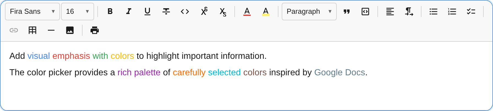

The `TextColorPlugin` provides a color picker popup for changing text color, with a customizable palette defaulting to Google Docs' 70-color grid.



## Usage

```ts
import { TextColorPlugin } from '@notectl/core';

new TextColorPlugin()
// or with custom colors:
new TextColorPlugin({
  colors: ['#000000', '#FF0000', '#00FF00', '#0000FF', '#FFFF00'],
})
```

## Configuration

```ts
interface TextColorConfig {
  /** Custom color palette (hex values). Default: Google Docs 70-color palette */
  readonly colors?: string[];
  /** Render separator after toolbar item. */
  readonly separatorAfter?: boolean;
}
```

Colors must be valid hex values (`#RGB` or `#RRGGBB`). Invalid values cause an error to be thrown. Duplicates (case-insensitive) are removed.

## Commands

| Command | Description | Returns |
|---------|-------------|---------|
| `removeTextColor` | Remove text color mark (reset to default) | `boolean` |

```ts
editor.executeCommand('removeTextColor');
```

Color application is handled through the toolbar popup's click handlers — each color swatch applies the corresponding `textColor` mark.

## Toolbar

The text color button shows a **color swatch preview** reflecting the current text color. Clicking opens a grid picker with all available colors. The currently active color is highlighted with a visual indicator.

## Mark Spec

| Mark | Attributes | Renders As |
|------|-----------|-----------|
| `textColor` | `color: string` | `<span style="color: #FF0000">` |

## Default Palette

When no custom `colors` are provided, the plugin uses a 70-color palette matching Google Docs, organized in a 10x7 grid from light to dark shades. The palette includes:

- **Row 1:** Pure colors (black, dark grey, dark red, etc.)
- **Rows 2-3:** Medium tones
- **Rows 4-7:** Light to pastel shades

## Custom Palette Example

```ts
// Brand colors only
new TextColorPlugin({
  colors: [
    '#1A1A1A', // Near black
    '#2563EB', // Brand blue
    '#16A34A', // Brand green
    '#DC2626', // Brand red
    '#9333EA', // Brand purple
    '#EA580C', // Brand orange
  ],
})
```
