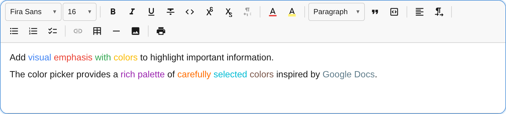

The `TextColorPlugin` provides a color picker popup for changing text color, with a customizable palette defaulting to Google Docs' 70-color grid.



## Usage

```ts
import { TextColorPlugin } from '@notectl/core/plugins/text-color';

new TextColorPlugin()
// or with custom colors:
new TextColorPlugin({
  colors: ['#000000', '#FF0000', '#00FF00', '#0000FF', '#FFFF00'],
})
```

## Configuration

```ts
interface TextColorConfig {
  /** Custom color palette (hex values). Default: Google Docs 70-color palette */
  readonly colors?: string[];
  /** Your own CSS class per color in class-based HTML. See "Custom CSS Classes". */
  readonly styleClasses?: Readonly<Record<string, string>>;
  /** Custom locale strings. */
  readonly locale?: TextColorLocale;
}
```

Colors must be valid hex values (`#RGB` or `#RRGGBB`). Invalid values cause an error to be thrown. Duplicates (case-insensitive) are removed.

## Custom CSS Classes

[Class-based HTML export](/notectl/guides/content-security-policy/#class-based-html-export-zero-inline-styles)
writes text colors as generated `notectl-s-*` classes. Map the colors your stylesheet knows to its
classes with `styleClasses`, keyed by hex color:

```ts
const BRAND_COLORS = { '#e03131': 'text-red', '#1971c2': 'text-blue' };

new TextColorPlugin({ colors: Object.keys(BRAND_COLORS), styleClasses: BRAND_COLORS });
```

```ts
const { html } = await editor.getContentHTML({ cssMode: 'classes', includeBlockIds: false });
// <p><span class="text-red">Important</span></p>
await editor.setContentHTML(html); // the color is restored without a styleMap
```

Keys are hex colors (`#RGB` or `#RRGGBB`, any case) and may include colors outside `colors`, for
example ones your stored content still uses. Import and paste read the classes back, and the
editor stores the color itself, never the class name. Inline export (`getContentHTML()`) keeps
writing `style="color: …"`. See [Custom CSS Classes](/notectl/guides/custom-css-classes/) for the rules shared by all formatting plugins.

## Commands

| Command | Description | Returns |
|---------|-------------|---------|
| `removeTextColor` | Remove text color mark (reset to default) | `boolean` |

```ts
editor.executeCommand('removeTextColor');
```

Color application is handled through the toolbar popup's click handlers — each color swatch applies the corresponding `textColor` mark.

## Toolbar

The text color button shows a **color swatch preview** reflecting the current text color. Clicking opens a grid picker with all available colors. The currently active color is highlighted with a visual indicator.

## Mark Spec

| Mark | Attributes | Renders As |
|------|-----------|-----------|
| `textColor` | `color: string` | `<span style="color: #FF0000">` |

## Default Palette

When no custom `colors` are provided, the plugin uses a 70-color palette matching Google Docs, organized in a 10x7 grid from light to dark shades. The palette includes:

- **Row 1:** Grayscale ramp (black to white)
- **Row 2:** Vivid pure colors (red, orange, yellow, green, cyan, blue, purple, magenta)
- **Rows 3-5:** Light to medium pastels
- **Rows 6-7:** Darker shades

## Custom Palette Example

```ts
// Brand colors only
new TextColorPlugin({
  colors: [
    '#1A1A1A', // Near black
    '#2563EB', // Brand blue
    '#16A34A', // Brand green
    '#DC2626', // Brand red
    '#9333EA', // Brand purple
    '#EA580C', // Brand orange
  ],
})
```
