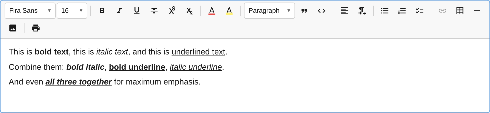

The `TextFormattingPlugin` provides inline text formatting marks: **bold**, *italic*, and underline.



## Usage

```ts
import { TextFormattingPlugin } from '@notectl/core';

new TextFormattingPlugin({
  bold: true,
  italic: true,
  underline: true,
})
```

This plugin is **auto-registered** if you don't explicitly add it. To customize which marks are enabled, add it explicitly.

## Configuration

```ts
interface TextFormattingConfig {
  /** Enable bold mark registration. Default: true */
  readonly bold: boolean;
  /** Enable italic mark registration. Default: true */
  readonly italic: boolean;
  /** Enable underline mark registration. Default: true */
  readonly underline: boolean;
  /** Control toolbar button visibility per mark */
  readonly toolbar?: TextFormattingToolbarConfig;
  /** Render a separator after the last visible button. Default: undefined */
  readonly separatorAfter?: boolean;
}

interface TextFormattingToolbarConfig {
  /** Show bold button. Default: true */
  readonly bold?: boolean;
  /** Show italic button. Default: true */
  readonly italic?: boolean;
  /** Show underline button. Default: true */
  readonly underline?: boolean;
}
```

### Disable a mark entirely

When a mark is disabled, it is not registered in the schema. The keyboard shortcut does nothing, and no toolbar button appears.

```ts
new TextFormattingPlugin({
  bold: true,
  italic: true,
  underline: false, // Not registered in schema — Ctrl+U has no effect
})
```

### Hide toolbar buttons but keep the mark

The mark remains functional (keyboard shortcuts work, programmatic toggle works), but the toolbar button is hidden:

```ts
new TextFormattingPlugin({
  bold: true,
  italic: true,
  underline: true,
  toolbar: {
    underline: false, // Hidden in toolbar, but Ctrl+U still works
  },
})
```

### Show disabled buttons

When a mark feature is disabled but the toolbar config explicitly enables the button, a disabled (greyed-out) button renders:

```ts
new TextFormattingPlugin({
  bold: true,
  italic: true,
  underline: false,
  toolbar: {
    underline: true, // Button visible but disabled
  },
})
```

## Commands

| Command | Description | Returns |
|---------|-------------|---------|
| `toggleBold` | Toggle bold mark on selection | `boolean` — `true` if applied |
| `toggleItalic` | Toggle italic mark on selection | `boolean` — `true` if applied |
| `toggleUnderline` | Toggle underline mark on selection | `boolean` — `true` if applied |

```ts
// Via executeCommand
editor.executeCommand('toggleBold');

// Via convenience shortcut
editor.commands.toggleBold();
```

## Keyboard Shortcuts

| Shortcut | Action |
|----------|--------|
| `Ctrl+B` / `Cmd+B` | Toggle bold |
| `Ctrl+I` / `Cmd+I` | Toggle italic |
| `Ctrl+U` / `Cmd+U` | Toggle underline |

## Mark Specs

| Mark | HTML Tag | Rank | Priority |
|------|----------|------|----------|
| `bold` | `<strong>` | 0 | 10 |
| `italic` | `<em>` | 1 | 20 |
| `underline` | `<u>` | 2 | 30 |

The `rank` determines the nesting order when multiple marks overlap. Lower rank = outer element. The `priority` controls toolbar button ordering.

## Toolbar Items

Each mark registers a toolbar item in the `format` group with:
- An SVG icon
- A tooltip showing the shortcut (e.g., "Bold (Ctrl+B)")
- An `isActive` check that highlights the button when the mark is active at the cursor
