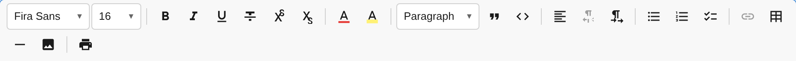

The `ToolbarPlugin` renders the editor toolbar UI. It is **automatically created** when you use the `toolbar` configuration option — you don't need to instantiate it manually.



## Automatic Setup

```ts
const editor = await createEditor({
  toolbar: [
    [new TextFormattingPlugin()],
    [new HeadingPlugin()],
  ],
});
// ToolbarPlugin is automatically created and registered
```

Each inner array becomes a visual **toolbar group** separated by dividers.

## Manual Setup

For advanced use cases, you can create the ToolbarPlugin manually:

```ts
import { ToolbarPlugin } from '@notectl/core';

const toolbar = new ToolbarPlugin({
  groups: [['text-formatting'], ['heading']],
});

const editor = await createEditor({
  plugins: [
    new TextFormattingPlugin(),
    new HeadingPlugin(),
    toolbar,
  ],
});
```

## Layout Configuration

```ts
interface ToolbarLayoutConfig {
  /** Plugin ID groups — each inner array is a visual toolbar group */
  readonly groups: ReadonlyArray<ReadonlyArray<string>>;
}
```

## Toolbar Items

Plugins register toolbar items via `context.registerToolbarItem()`:

```ts
interface ToolbarItem {
  /** Unique identifier. */
  readonly id: string;
  /** Logical group for auto-grouping (e.g., 'format', 'block'). */
  readonly group: string;
  /** HTML string for the button icon. */
  readonly icon: string;
  /** Accessible label for screen readers. */
  readonly label: string;
  /** Tooltip text shown on hover. */
  readonly tooltip?: string;
  /** Command to execute on click. */
  readonly command: string;
  /** Ordering within group (lower = further left). */
  readonly priority: number;
  /** Render a separator after this button. */
  readonly separatorAfter?: boolean;
  /** Popup type: 'dropdown', 'gridPicker', or 'custom'. */
  readonly popupType?: 'dropdown' | 'gridPicker' | 'custom';
  /** Configuration for dropdown or gridPicker popups. */
  readonly popupConfig?: GridPickerConfig | DropdownConfig;
  /** Custom popup render function. */
  renderPopup?(container: HTMLElement, context: PluginContext): void;
  /** Returns true when the item should appear active/pressed. */
  isActive?(state: EditorState): boolean;
  /** Returns true when the item should be enabled. */
  isEnabled?(state: EditorState): boolean;
}
```

## Popup Types

| Type | Description | Used By |
|------|-------------|---------|
| `dropdown` | Vertical list of options | HeadingPlugin, AlignmentPlugin |
| `gridPicker` | 2D grid for dimension selection | TablePlugin |
| `custom` | Full control over popup rendering | FontPlugin, FontSizePlugin, TextColorPlugin, LinkPlugin |

## ToolbarService

The toolbar exposes a typed service for programmatic control:

```ts
import { ToolbarServiceKey } from '@notectl/core';

const toolbarService = context.getService(ToolbarServiceKey);

// Force refresh of all button states
toolbarService.refresh();
```

```ts
interface ToolbarServiceAPI {
  /** Re-reads isActive/isEnabled from state and updates all buttons. */
  refresh(): void;
  /** Closes any open toolbar popup (font picker, color picker, etc.). */
  closePopup(): void;
}
```

## Button States

The toolbar automatically updates button states on every state change:
- **Active** (`aria-pressed="true"`) — when `isActive()` returns `true` (e.g., bold button when cursor is in bold text)
- **Disabled** (`aria-disabled="true"`) — when `isEnabled()` returns `false`
- **Popup open** — visual indicator when a popup is visible

## Accessibility

The toolbar element has:
- `role="toolbar"` for screen readers
- `aria-label="Formatting options"`
- Individual buttons with `aria-pressed` and `aria-label`
- Tooltip on hover (500ms delay)
