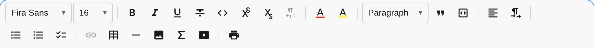

The `ToolbarPlugin` renders the editor toolbar UI. It is **automatically created** when you use the `toolbar` configuration option — you don't need to instantiate it manually.



## Automatic Setup

```ts
const editor = await createEditor({
  toolbar: [
    [new TextFormattingPlugin()],
    [new HeadingPlugin()],
  ],
});
// ToolbarPlugin is automatically created and registered
```

Each inner array becomes a visual **toolbar group** separated by dividers.

## Manual Setup

For advanced use cases, you can create the ToolbarPlugin manually:

```ts
import { ToolbarPlugin } from '@notectl/core/plugins/toolbar';

const toolbar = new ToolbarPlugin({
  groups: [['text-formatting'], ['heading']],
});

const editor = await createEditor({
  plugins: [
    new TextFormattingPlugin(),
    new HeadingPlugin(),
    toolbar,
  ],
});
```

## Layout Configuration

```ts
interface ToolbarLayoutConfig {
  /** Plugin ID groups — each inner array is a visual toolbar group */
  readonly groups: ReadonlyArray<ReadonlyArray<string>>;
  /** Controls responsive overflow. Default: ToolbarOverflowBehavior.BurgerMenu */
  readonly overflow?: ToolbarOverflowBehavior;
}
```

The `overflow` field controls how items behave when the toolbar is too narrow. See the [Toolbar Configuration guide](/notectl/guides/toolbar/#responsive-overflow-behavior) for the available modes (`BurgerMenu`, `Flow`, `None`).

## Toolbar Items

Plugins register toolbar items via `context.registerToolbarItem()`:

```ts
interface ToolbarItemBase {
  /** Unique identifier. */
  readonly id: string;
  /** Logical group for auto-grouping (e.g., 'format', 'block'). */
  readonly group: string;
  /** HTML string for the button icon. */
  readonly icon: string;
  /** Accessible label for screen readers. */
  readonly label: string;
  /** Tooltip text shown on hover. */
  readonly tooltip?: string;
  /** Command to execute on click. */
  readonly command: string;
  /** Optional dynamic icon callback. When provided, the icon updates on every state change. */
  getIcon?(state: EditorState): string;
  /** Returns true when the item should appear active/pressed. */
  isActive?(state: EditorState): boolean;
  /** Returns true when the item should be enabled. */
  isEnabled?(state: EditorState): boolean;
}

// Discriminated union — popupType determines which extra fields are available:
interface ToolbarItemGridPicker extends ToolbarItemBase {
  readonly popupType: 'gridPicker';
  readonly popupConfig: GridPickerConfig;
}
interface ToolbarItemDropdown extends ToolbarItemBase {
  readonly popupType: 'dropdown';
  readonly popupConfig: DropdownConfig;
}
interface ToolbarItemCustomPopup extends ToolbarItemBase {
  readonly popupType: 'custom';
  /** Called to render arbitrary popup content. Use onClose() to dismiss. */
  renderPopup(container: HTMLElement, context: PluginContext, onClose: (options?: PopupCloseOptions) => void): void;
}
interface ToolbarItemNoPopup extends ToolbarItemBase {
  readonly popupType?: undefined;
}

interface ToolbarItemCombobox extends Omit<ToolbarItemBase, 'icon'> {
  readonly popupType: 'combobox';
  /** Optional icon — combobox items typically display a text label instead. */
  readonly icon?: string;
  /** Pure function returning the current label text. Called on every state change. */
  getLabel(state: EditorState): string;
  /** Renders the popup content when the combobox is opened. */
  renderPopup(container: HTMLElement, context: PluginContext, onClose: (options?: PopupCloseOptions) => void): void;
}

type ToolbarItem =
  | ToolbarItemNoPopup
  | ToolbarItemGridPicker
  | ToolbarItemDropdown
  | ToolbarItemCustomPopup
  | ToolbarItemCombobox;
```

## Popup Types

| Type | Description | Used By |
|------|-------------|---------|
| `dropdown` | Vertical list of options | HeadingPlugin, AlignmentPlugin |
| `gridPicker` | 2D grid for dimension selection | TablePlugin |
| `custom` | Full control over popup rendering | TextColorPlugin, HighlightPlugin, LinkPlugin |
| `combobox` | Text label with listbox popup (`role="combobox"`, `aria-haspopup="listbox"`) | FontPlugin, FontSizePlugin |

## Runtime API

### `getOverflowBehavior(): ToolbarOverflowBehavior`

Returns the current overflow behavior mode.

### `setOverflowBehavior(behavior: ToolbarOverflowBehavior): void`

Switches the overflow behavior at runtime. Triggers an immediate re-layout.

```ts
import { ToolbarOverflowBehavior } from '@notectl/core/plugins/toolbar';

// Switch to flow mode at runtime
toolbarPlugin.setOverflowBehavior(ToolbarOverflowBehavior.Flow);
```

## ToolbarService

The toolbar exposes a typed service for programmatic control:

```ts
import { ToolbarServiceKey } from '@notectl/core/plugins/toolbar';

const toolbarService = context.getService(ToolbarServiceKey);

// Force refresh of all button states
toolbarService.refresh();
```

```ts
interface ToolbarServiceAPI {
  /** Re-reads isActive/isEnabled from state and updates all buttons. */
  refresh(): void;
  /** Closes any open toolbar popup (font picker, color picker, etc.). */
  closePopup(): void;
}
```

## Read-Only Mode

When the editor enters read-only mode, the toolbar automatically hides itself. When read-only mode is disabled, the toolbar reappears.

## Button States

The toolbar automatically updates button states on every state change:
- **Active** (`aria-pressed="true"` + `part="toolbar-button toolbar-button-active"`) — when `isActive()` returns `true` (e.g., bold button when cursor is in bold text). The modifier part is kept in sync with `aria-pressed` and is the recommended way to style the active state from outside the shadow root.
- **Disabled** (`aria-disabled="true"`) — when `isEnabled()` returns `false`
- **Popup open** — visual indicator when a popup is visible

## Theming

The toolbar participates in the [three-tier theming cascade](/notectl/guides/styling/#theming-contract-three-tier-cascade). The existing `--notectl-toolbar-bg` and `--notectl-toolbar-border` are theme-driven; new button-level tokens are CSS-only:

```css
notectl-editor {
  --notectl-toolbar-button-bg: #fafafa;
  --notectl-toolbar-button-hover-bg: #f0f0f0;
  --notectl-toolbar-button-active-bg: #6366f1;
  --notectl-toolbar-button-active-fg: #ffffff;
}
```

| Token | Default fallback |
|---|---|
| `--notectl-toolbar-button-bg` | `transparent` |
| `--notectl-toolbar-button-fg` | `var(--notectl-fg)` |
| `--notectl-toolbar-button-hover-bg` | `var(--notectl-hover-bg)` |
| `--notectl-toolbar-button-active-bg` | `var(--notectl-active-bg)` |
| `--notectl-toolbar-button-active-fg` | `var(--notectl-primary-fg)` |

### Shadow Parts

The toolbar exposes structural parts so consumers can target it via `::part()` without piercing the shadow DOM:

| Part | Element | Notes |
|---|---|---|
| `toolbar` | Toolbar root | |
| `toolbar-group` | Group wrapper around a logical cluster of buttons | Real flex container — `padding`, `background`, `border` apply directly |
| `toolbar-button` | Any toolbar button | |
| `toolbar-button` + `toolbar-button-active` | Active button | Modifier part synced with `aria-pressed` |
| `toolbar-button` + `toolbar-overflow-button` | The "more" button in burger-menu mode | |
| `toolbar-divider` | Group separator | |

Example — pill-shaped buttons with a custom active gradient:

```css
notectl-editor::part(toolbar-button) {
  border-radius: 9999px;
}
notectl-editor::part(toolbar-button-active) {
  background: linear-gradient(135deg, #6366f1, #8b5cf6);
  color: #ffffff;
}
```

Example — tint each group with a soft background and rounded corners:

```css
notectl-editor::part(toolbar-group) {
  background: var(--my-group-bg);
  border-radius: 6px;
  padding: 0 4px;
}
```

### Group-aware overflow

In `ToolbarOverflowBehavior.BurgerMenu` mode (the default), overflow is measured at the
**group level**: when any button in a group would not fit, the entire group moves into
the burger menu so logical clusters stay together. Standalone buttons appended directly
to the toolbar (without a group wrapper) are treated as single-button groups.

### Accessible group labels

The internal `ToolbarLayoutConfig` accepts an object form per group so groups can carry
an accessible name. When a `label` is provided, the wrapper additionally receives
`role="group"` and `aria-label`:

```ts
new ToolbarPlugin({
  groups: [
    { plugins: ['text-formatting'], label: 'Text formatting' },
    { plugins: ['heading'], label: 'Headings' },
    ['lists'], // unlabeled — wrapper stays role-less, no aria-label
  ],
});
```

The same object form is accepted at the editor level via `createEditor({ toolbar: { groups: [...] } })`
where each entry is either a `ReadonlyArray<Plugin>` or `{ plugins: ReadonlyArray<Plugin>; label?: string }`.

When no `label` is set, the wrapper carries only `part="toolbar-group"` for styling and
is **not** announced as a group by assistive technology — this matches the W3C ARIA
APG toolbar example, where unlabeled sub-groups stay purely structural.

## Accessibility

### Toolbar

The toolbar element has:
- `role="toolbar"` for screen readers
- Localized `aria-label` (defaults to "Formatting options" in English)
- Individual buttons with `aria-pressed` and `aria-label`
- Tooltip on hover (500ms delay)

**Keyboard navigation** (roving tabindex):

| Key | Action |
|-----|--------|
| `ArrowRight` | Move focus to next button |
| `ArrowLeft` | Move focus to previous button |
| `Home` | Move focus to first enabled button |
| `End` | Move focus to last enabled button |
| `Enter` / `Space` | Activate the focused button |

### Overflow Dropdown

When the "..." overflow button is visible:
- The button has `aria-haspopup="true"` and `aria-expanded` toggled on open/close
- Localized `aria-label` (defaults to "More tools" in English)
- The dropdown menu has `role="menu"` with `role="menuitem"` children
- Group separators use `role="separator"`

**Dropdown keyboard navigation:**

| Key | Action |
|-----|--------|
| `ArrowDown` | Move focus to next menu item |
| `ArrowUp` | Move focus to previous menu item |
| `Enter` / `Space` | Activate the focused item |
| `Escape` / `Tab` | Close dropdown, return focus to overflow button |
