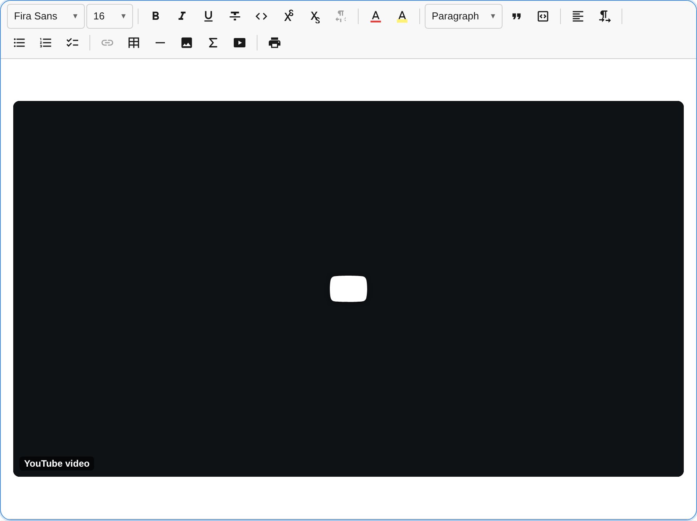
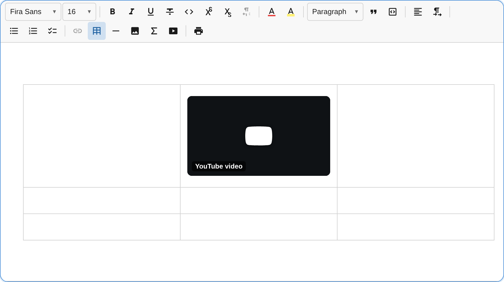
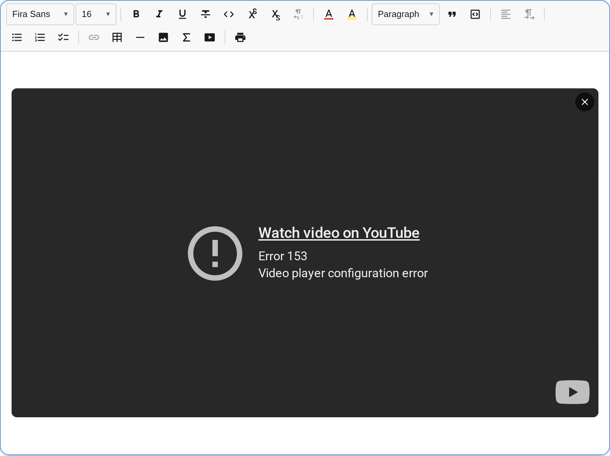

The `VideoPlugin` embeds hosted videos as selectable, void blocks rendered behind a privacy-first click-to-load facade. Every embed URL is derived by pure client-side parsing with no oEmbed, no provider SDK, and no network request before the user clicks Play. Zero new dependencies (uses DOMPurify already present in the bundle).



## Usage

```ts
import { VideoPlugin } from '@notectl/core/plugins/video';

new VideoPlugin()
// or with custom config:
new VideoPlugin({
  privacy: true,
  facade: true,
  useProviderThumbnail: false,
  defaultAspectRatio: '16/9',
  defaultWidthPercent: 100,
})
```

`VideoPlugin` is included automatically in `createFullPreset()`, so no manual wiring is needed when using the full preset.

## Configuration

```ts
interface VideoPluginConfig {
  /** Declarative provider registry. Default: YouTube, Vimeo, Dailymotion. */
  readonly providers: VideoProvider[];
  /** Use the privacy-first facade (click-to-load). @default true */
  readonly facade: boolean;
  /**
   * Load the provider thumbnail in the facade. A provider thumbnail is a
   * third-party request, so it is off by default to preserve the
   * zero-contact-before-consent guarantee. @default false
   */
  readonly useProviderThumbnail: boolean;
  /** Use privacy-enhanced hosts/params (nocookie / dnt). @default true */
  readonly privacy: boolean;
  /** Aspect ratios offered in the editing UI. */
  readonly allowedAspectRatios: string[];
  /** Default aspect ratio for newly inserted videos. @default '16/9' */
  readonly defaultAspectRatio: string;
  /** Default responsive width (percent of content column). @default 100 */
  readonly defaultWidthPercent: number;
  /** Minimum responsive width (percent). @default 25 */
  readonly minWidthPercent: number;
  /** Percent to grow/shrink per small resize step. @default 10 */
  readonly widthStep: number;
  /** Percent to grow/shrink per large resize step. @default 25 */
  readonly widthStepLarge: number;
  /** Whether videos are resizable. @default true */
  readonly resizable: boolean;
  /** Customize keyboard bindings for video resize actions. */
  readonly keymap?: VideoKeymap;
  /** Locale override for user-facing strings. */
  readonly locale?: VideoLocale;
}
```

### `VideoKeymap`

Customize or disable individual keyboard resize bindings. Set a slot to `null` to disable it.

```ts
interface VideoKeymap {
  readonly growWidth?: string | null;
  readonly shrinkWidth?: string | null;
  readonly growWidthLarge?: string | null;
  readonly shrinkWidthLarge?: string | null;
  readonly resetSize?: string | null;
}
```

### Custom Providers

A `VideoProvider` is a plain object. Adding a new provider requires only one configuration object:

```ts
import { VideoPlugin, DEFAULT_VIDEO_PROVIDERS } from '@notectl/core/plugins/video';
import type { VideoProvider } from '@notectl/core/plugins/video';

const peerTubeProvider: VideoProvider = {
  id: 'peertube',
  label: 'PeerTube',
  hostnames: ['peertube.example.org'],
  embedHostnames: ['peertube.example.org'],
  parse(url: URL) {
    const m = url.pathname.match(/^\/videos\/watch\/([a-f0-9-]+)$/);
    return m ? { videoId: m[1] } : null;
  },
  buildEmbedUrl(match, _options) {
    return `https://peertube.example.org/videos/embed/${match.videoId}`;
  },
  buildWatchUrl(match) {
    return `https://peertube.example.org/videos/watch/${match.videoId}`;
  },
};

new VideoPlugin({ providers: [...DEFAULT_VIDEO_PROVIDERS, peerTubeProvider] });
```

## Supported Providers

The built-in provider registry handles the following URL shapes without any API calls:

| Provider | Supported URL Forms |
|----------|-------------------|
| YouTube | `youtube.com/watch?v=`, `youtu.be/`, `youtube.com/shorts/`, `youtube.com/live/`, `youtube-nocookie.com/embed/` |
| Vimeo | `vimeo.com/<id>`, `vimeo.com/<user>/<id>?h=<hash>` (unlisted) |
| Dailymotion | `dailymotion.com/video/<id>`, `dai.ly/<id>` |

## Insertion and Editing

### Toolbar button

The Insert group in the toolbar shows a video icon. Clicking it opens an accessible form with:

- **Video URL** (required): any supported provider URL
- **Title** (required): descriptive accessible name for the embed (e.g. "How to set up notectl in 3 minutes")
- **Caption** (optional): rendered as a visible `<figcaption>` beneath the embed
- **Aspect ratio**: dropdown selecting from the configured ratios (default: 16/9, 4/3, 1/1, 9/16)

The form blocks submission until the title field is filled, enforcing the accessibility requirement at the point of entry.

### Ask-first paste

Pasting a bare video URL keeps it as text and shows an announced "Embed this video?" affordance. The URL is never silently converted; the user is always in control. Clicking "Embed" opens the insert form pre-filled with the URL; the user can then add the required title before inserting.

### On-selection toolbar

When a video block is selected (node selection), a contextual toolbar appears with:

- **Edit**: reopen the form to change URL, title, caption, or aspect ratio
- **Align left / center / right**: change the logical alignment of the embed
- **Delete**: remove the video block

### Resizing

Drag the side handles to resize, or use keyboard shortcuts while the video is selected. Width is expressed as a percentage of the content column, so it remains responsive at any editor size.

## Commands

| Command | Description | Returns |
|---------|-------------|---------|
| `insertVideo` | Open the insert form (or edit form when a video is selected) | `boolean` |
| `removeVideo` | Remove the currently selected video block | `boolean` |
| `resizeVideoGrow` | Increase width by `widthStep` (default 10%) | `boolean` |
| `resizeVideoShrink` | Decrease width by `widthStep` (default 10%) | `boolean` |
| `resizeVideoGrowLarge` | Increase width by `widthStepLarge` (default 25%) | `boolean` |
| `resizeVideoShrinkLarge` | Decrease width by `widthStepLarge` (default 25%) | `boolean` |
| `resetVideoSize` | Reset width to `defaultWidthPercent` (default 100%) | `boolean` |

```ts
editor.executeCommand('insertVideo');
editor.executeCommand('removeVideo');
editor.executeCommand('resizeVideoGrow');
```

## Keyboard Shortcuts

When a video block is selected (node selection):

| Shortcut | Command | Description |
|----------|---------|-------------|
| `Mod-Shift-ArrowRight` | `resizeVideoGrow` | Grow width by small step (10%) |
| `Mod-Shift-ArrowLeft` | `resizeVideoShrink` | Shrink width by small step (10%) |
| `Mod-Shift-Alt-ArrowRight` | `resizeVideoGrowLarge` | Grow width by large step (25%) |
| `Mod-Shift-Alt-ArrowLeft` | `resizeVideoShrinkLarge` | Shrink width by large step (25%) |
| `Mod-Shift-0` | `resetVideoSize` | Reset to default width |

`Mod` is Cmd on macOS and Ctrl on Windows/Linux. All shortcuts are customizable via the `keymap` config option.

## Node Spec

| Type | HTML Tag | Attributes | Description |
|------|----------|-----------|-------------|
| `video` | `<figure class="notectl-video">` | `provider`, `videoId`, `aspectRatio`, `widthPercent`, `align`, `title`, `caption?`, `hash?`, `privacy` | Video embed block (void) |

The video block is a **void block**: it is not editable but can be selected (node selection). The node never stores raw `<iframe>` HTML; the live iframe is constructed at view time from `provider` and `videoId`. This separation is both the privacy keystone and the security keystone: a future change in embed URL structure only requires updating the provider's `buildEmbedUrl()` function, not migrating stored content.

## Video Inside a Table Cell

Videos can be embedded directly inside table cells. Use the toolbar button while the caret is inside a cell, or click into a cell before using `editor.executeCommand('insertVideo')`.



## Activated Embed

Once the user clicks the Play facade, the privacy-enhanced iframe is built and replaces the facade. The exit button (top-right) returns focus to the facade without reloading the page.



## Accessibility

Accessibility is a primary design constraint of the Video plugin, not an optional add-on. This is the main differentiator from most editor video embeds.

### Descriptive iframe title (WCAG SC 4.1.2, Level A)

The insert form requires a non-empty, descriptive title before it allows submission. This title becomes the `title` attribute of the `<iframe>` element, which is what screen readers announce when the user enters the player. A good title describes the video content ("How to set up notectl in 3 minutes"); a poor title ("YouTube video player") adds no information. The plugin enforces the good pattern at the point of insertion.

### Play button as a real control

The facade Play control is a native `<button>` element. It is keyboard-operable with Enter and Space, receives focus in tab order, and is visible in forced-colors/high-contrast mode.

### Focus management after activation

When the user activates the facade, focus moves into the embedded player. An always-reachable exit control is provided to return focus to the facade after leaving the player. This mitigates the cross-origin iframe keyboard-trap risk described in WCAG SC 2.1.1 and SC 2.1.2.

### No autoplay on load

The facade means no `<iframe>` exists on the page until the user explicitly clicks Play. Only after that user gesture is the iframe built with `autoplay=1`. This is the established facade pattern and is not a load-time autoplay violation (WCAG Failure F93 applies to autoplay at page load, not user-gesture-gated activation). Under `@media (prefers-reduced-motion: reduce)` the player loads paused, satisfying SC 2.2.2 for motion-sensitive users.

### Screen reader announcements

- When a video is selected, a polite announcement names the video and describes the available resize shortcuts.
- After each resize operation, the new width percentage is announced.
- Entering and exiting the player is announced.

### Accessible figure and caption

The `<figure>` element has an `aria-label` combining the provider name and title. When a caption is provided, it is rendered as `<figcaption>` inside the figure.

### Forced-colors support

The facade button and its focus ring use CSS `forced-colors` overrides so they remain visible in Windows High Contrast mode and other forced-color themes.

## Privacy and Security

### Zero contact before consent

The facade (click-to-load) is on by default. No request is made to the video provider, not even a thumbnail fetch, until the user clicks Play. The default facade uses a local placeholder graphic. Provider thumbnails are opt-in via `useProviderThumbnail: true`, because loading a provider thumbnail is itself a third-party request that breaks the zero-contact guarantee.

This default is safe for GDPR / Schrems II: the provider receives no user IP address, no referrer, and no cookie until the user gives explicit consent by clicking.

### Privacy-enhanced embed URLs

On activation, the plugin builds privacy-enhanced URLs by default:

- YouTube: `https://www.youtube-nocookie.com/embed/{id}`
- Vimeo: `https://player.vimeo.com/video/{id}?dnt=1`
- Dailymotion: standard embed (Dailymotion does not offer an equivalent nocookie host)

All iframes additionally carry `referrerpolicy="no-referrer"` and `loading="lazy"`.

Disable this behaviour with `privacy: false` if your deployment already handles consent and you need full provider features.

### HTML export

The HTML export produces a progressive-enhancement `<figure>` containing a labelled watch link:

```html
<figure data-video-provider="youtube" data-video-id="dQw4w9WgXcQ"
        data-video-ratio="16/9" data-video-width="100" data-video-privacy="true">
  <a href="https://www.youtube.com/watch?v=dQw4w9WgXcQ" rel="noopener noreferrer">
    How to set up notectl in 3 minutes
  </a>
</figure>
```

A notectl renderer upgrades this to the facade. In any other context it degrades to a privacy-preserving link. A plain `<iframe>` export would leak the privacy promise on every page that renders the exported HTML.

### DOMPurify host-allowlist hook

Imported `<iframe>` elements (e.g. from pasted HTML or loaded HTML content) pass through a DOMPurify hook that validates the `src` attribute against the exact HTTPS hostnames of the configured provider embed hosts. The hook rejects:

- Non-HTTPS schemes
- `srcdoc` attributes
- Hostnames not in the allowlist (including look-alikes such as `evilyoutube.com` and `youtube.com.evil.com`)
- The `username@evil.com` userinfo trick

The allowlist is derived automatically from the configured providers, so custom providers are covered without additional configuration.

### Content Security Policy

Integrators using a `Content-Security-Policy` header must add the embed hosts to `frame-src`. For the built-in providers:

```
Content-Security-Policy: frame-src https://www.youtube-nocookie.com https://www.youtube.com https://player.vimeo.com https://www.dailymotion.com https://geo.dailymotion.com;
```

Keep this in sync with the `embedHostnames` of any custom providers you add.

## Localization

Nine locales ship out of the box: `en`, `de`, `es`, `fr`, `zh`, `ru`, `ar`, `hi`, `pt`. The locale is resolved automatically from the browser language unless overridden.

To use a specific locale, import the English default and pass a dynamically loaded locale:

```ts
import { VideoPlugin, loadVideoLocale } from '@notectl/core/plugins/video';

// Load a locale by browser tag (falls back to en automatically):
const locale = await loadVideoLocale('de');
new VideoPlugin({ locale });
```

## Phase Note

This is Phase 1: embedding videos from hosted providers (YouTube, Vimeo, Dailymotion). Phase 2 is planned and will add self-hosted native `<video>` blocks with `<source>` elements, WebVTT `<track>` captions, and an upload-service hook following the same pattern as the image plugin.
